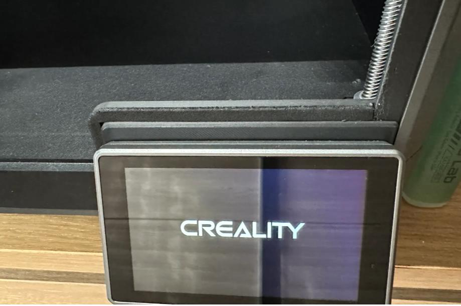
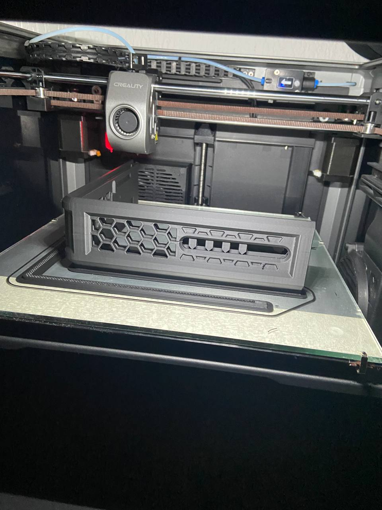
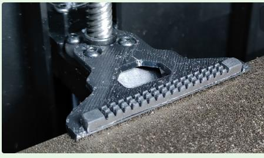
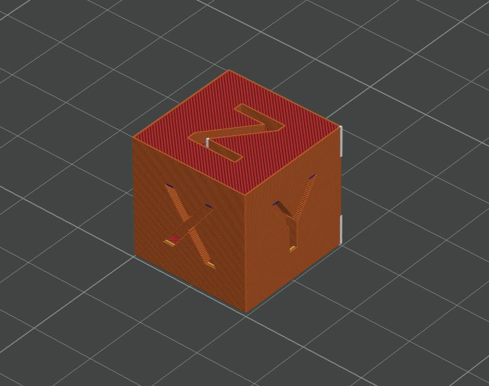
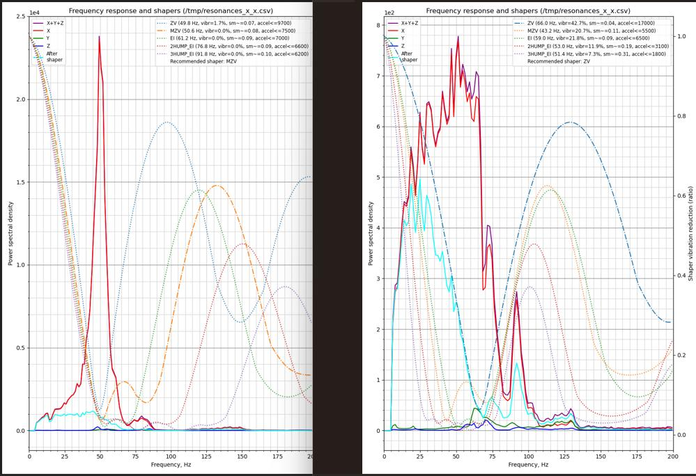
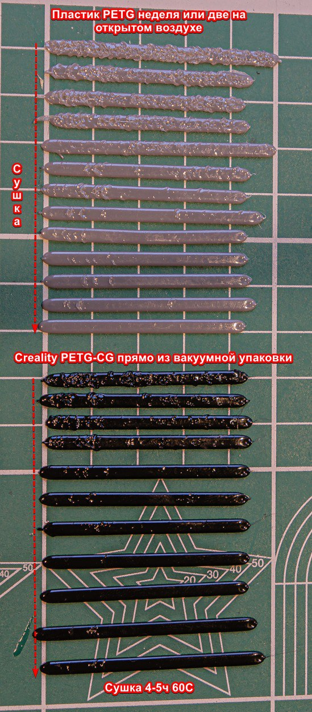
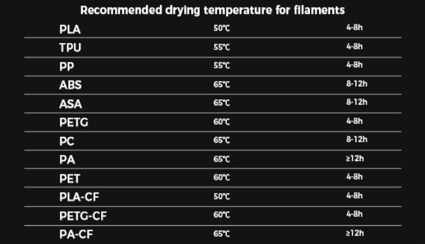
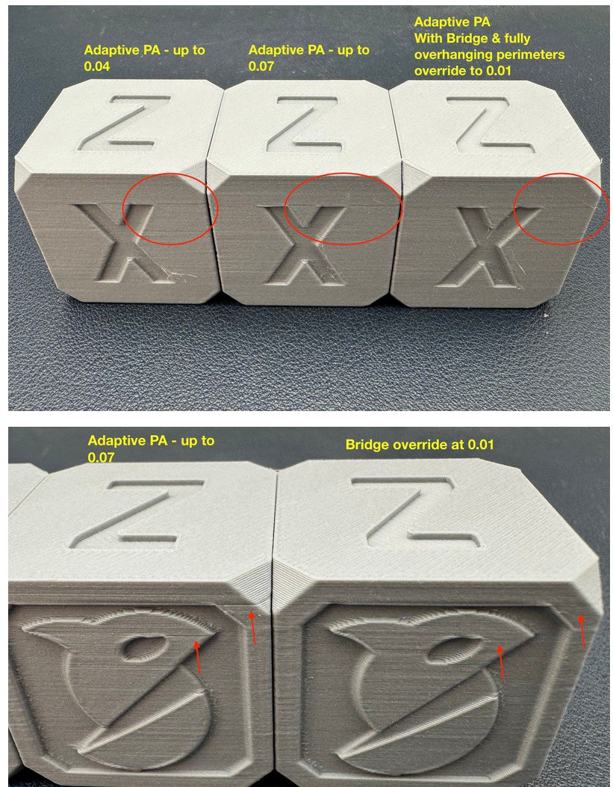

[↩️ Назад в главное меню](../readme.md)

---

# 📚 Дополнительные материалы к лекциям

> Полезные модели для печати, руководства по калибровке и видео-материалы

<h3 align="right"><a href="https://www.tinkoff.ru/rm/yakovleva.irina203/51ZSr71845" target="_blank">💝 Поддержать автора</a></h3>

---

## 📑 Оглавление

- [🔧 Печатные модели](#-печатные-модели)
- [🛠️ Устранение проблем со столом](#️-устранение-проблем-со-столом)
- [📊 Шейперы и калибровка](#-шейперы-и-калибровка)
- [🎯 Калибровка филамента](#-калибровка-филамента)
- [🎬 Видео-материалы](#-видео-материалы)
- [💧 Влажность пластика](#-влажность-пластика)
- [🛒 Расходные материалы](#-расходные-материалы)
- [⚙️ Adaptive PA](#️-adaptive-pa)

---

## 🔧 Печатные модели

### 1. Прокладка под экран

Уменьшает приток холодного воздуха в камеру принтера:

- **[K1 MAX](https://www.printables.com/model/553930-creality-k1-max-door-cover)**
- **[K1 / K1C](https://t.me/crealityK1rus/16778/293569)**



### 2. Проставка для вентиляции

Устанавливается между корпусом и крышкой для улучшения воздухообмена:

- **[K1 / K1C](https://www.printables.com/model/525295-jc-creality-k1-hinged-lid-riser)**
- **[K1 MAX](https://t.me/crealityK1rus/16778/109114)**



### 3. Держатель резинки прочистки

- **[Для K1C](https://t.me/crealityK1rus/16778/217607)**



### 4. Тестовый кубик

**[Скачать обычный тестовый кубик](Cube.stl)**



---

## 🛠️ Устранение проблем со столом

### Методы исправления кривизны:

1. **[Установка стекла для исправления кривизны](https://www.youtube.com/watch?v=6vU0u630IjU&t=867s&ab_channel=ZeroDotCMD)** - видео на YouTube (англ.) | [Видео в чате K1](https://t.me/crealityK1rus/9504/602859)

2. **[Быстрое исправление наклона стола](https://www.youtube.com/watch?v=S2d_9Ysz-Q8&ab_channel=ZeroDotCMD)** - видео на YouTube (англ.)

3. **[Видеопояснение от пользователей](https://t.me/crealityK1rus/152020/451660)** - на русском в Telegram

---

## 📊 Шейперы и калибровка

### Что такое шейперы:



**Подробные материалы:**
- **[Материал на русском](https://github.com/Tombraider2006/klipperFB6/tree/main/accel_graph)** - подробная статья
- **[Материал на английском](https://github.com/Frix-x/klippain-shaketune/blob/main/docs/macros/axes_shaper_calibrations.md)** - от разработчиков
- **[Как понять графики шейперов](/shaper/readme.md)** - анализ графиков для K1 серии
- **[Регулировка натяжения ремней](/random/belts/readme.md)** - по графикам
- **[Helper Script меню](/random/menu.md)** - полезные функции

---

## 🎯 Калибровка филамента

### Порядок калибровки:

1. **Поток** (Экструзия)
2. **[Linear Advance](https://k3d.tech/calibrations/la/calibrator/)** (Pressure Advance)
3. **[Тест откатов](https://k3d.tech/calibrations/retractions/calibrator/)** (Retraction)
4. **Температура**
5. **Максимальная объемная скорость**

### G-коды для тестов Соркина:

⚠️ **Важно:** Используйте эти коды при калибровке PA и ретрактов

**Стартовый код:**
```gcode
_FULL_BED_MESH_ON
_ADAPTIVE_PURGE_LINE_OFF
START_PRINT EXTRUDER_TEMP=$HOTTEMP BED_TEMP=$BEDTEMP
```

**Конечный код:**
```gcode
SET_PIN PIN=FULL_BED_MESH VALUE=0
_ADAPTIVE_PURGE_LINE_ON
END_PRINT
```

---

## 🎬 Видео-материалы

### Слайсеры и настройка:

- **[Почему OrcaSlicer](https://youtu.be/0TzEFStKH90?si=3XKylqedC36pHxEK)** - обзор слайсера
- **[OrcaSlicer - Установка, Настройка, Работа](https://youtu.be/LeLj5oCacak?si=SBsEC19GKPhX8TuF)** - полное руководство
- **[Калибровка точности в OrcaSlicer](https://youtu.be/xzC4Fdf7mDU?si=dvUSbCUAnS6y5BpE)**
- **[Частые ошибки настройки 3D принтеров](https://youtu.be/3qv3-SMg5xY?si=traAK1FHAlSTLU77)**

### Материалы и калибровка:

- **[Все о филаментах](https://www.youtube.com/watch?v=CzgOCkJbcxE)** - подробный обзор
- **[Калибровка точности по Соркину](https://youtu.be/6seFEWIGTtU?si=9I6r6bh5QEWTt1Us)**
- **[Диаметр сопла: 0,4 vs 0,6](https://youtu.be/sNIYDhxbMe4?si=B41wK4Hl-1oPrVQ_)** - производительность

### 3D моделирование:

- **[Приемы моделирования для 3D печати](https://youtu.be/64Ce6Of0N2Q?si=uoQyqhyEkVIPD1hb)**

---

## 💧 Влажность пластика

### Как определить влажность:

Пользователь сфотографировал полоски Line Purge от KAMP - видны дефекты от влажного пластика:



⚠️ **Важно:** Даже пластик Creality в вакуумной упаковке с силикагелем может быть влажным!

**Рекомендации по сушке от Creality:**



---

## 🛒 Расходные материалы

### Расходные жидкости:

- Клей для FDM 3D печати
- Смазка для 3D принтеров
- Композитные полимерные материалы для 3D печати
- Матирующие спреи для 3D сканирования

**Где купить:** Через бот **@ATECOBot** или штучно на Ozon. Через бота - накопительная скидка | [Официальная группа](https://t.me/atecoru)

### Рекомендуемые пластики:

- **ABS** - [hi-tech-plast](https://www.ozon.ru/category/plastik-dlya-3d-printera-15794/hi-tech-plast-87286623/)
- **PETG** - [mako](https://www.ozon.ru/brand/mako-100524697/)
- **PLA** - [Eryone](https://www.ozon.ru/category/plastik-dlya-3d-printera-15794/eryone-100430904/)

---

## ⚙️ Adaptive PA

### Что это и зачем?

Разработчики OrcaSlicer решают проблему Pressure Advance на мостах и нависаниях.

**Проблема:** На мостах откалиброванный PA неприменим - сопло быстро теряет давление при экструзии в воздух. При возврате на стенку требуется время для восстановления давления → появляется полоса после моста.

**Решение:** Две новые функции:
1. **PA Bridge Override** - отдельная настройка PA для мостов
2. **Adaptive PA** - автоматическое изменение PA при изменении объемного потока

**В Klipper:** Решается проблема "PA change stutter" - дефекты на стенках при выходе из нависаний



---

<div align="center">

**[↩️ Вернуться в главное меню](../readme.md)**

</div>


