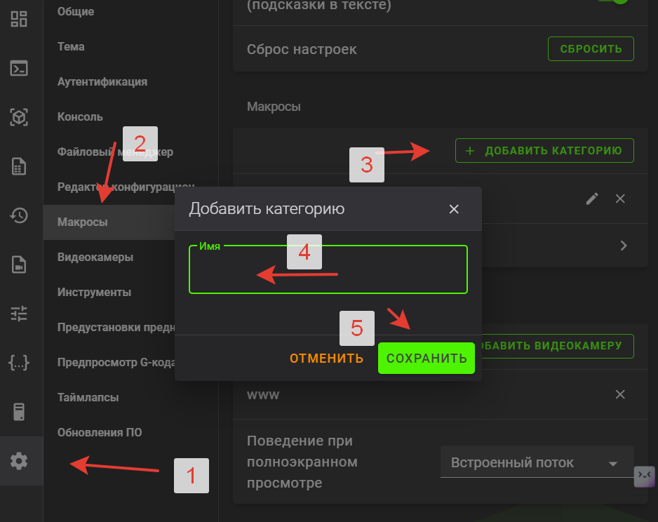
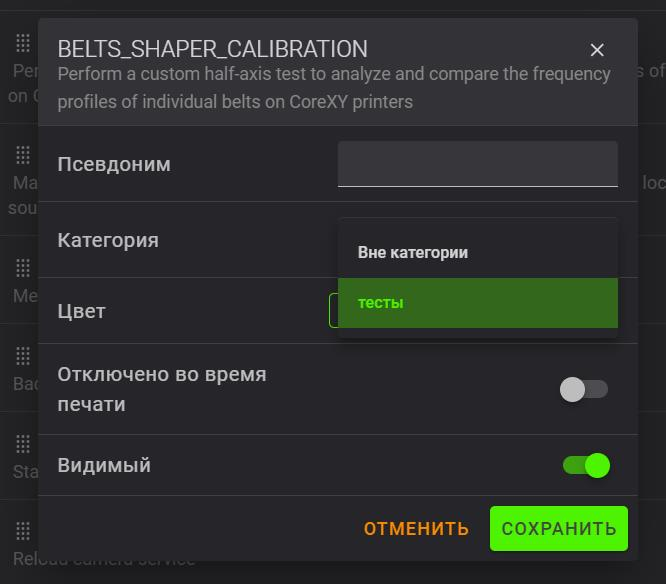
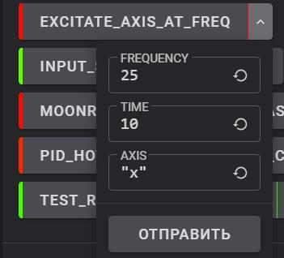
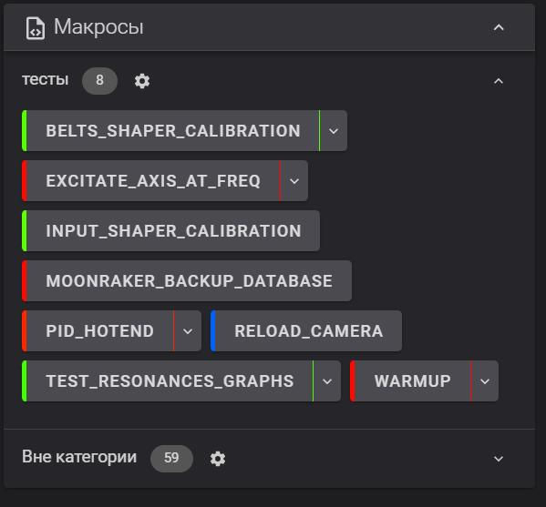
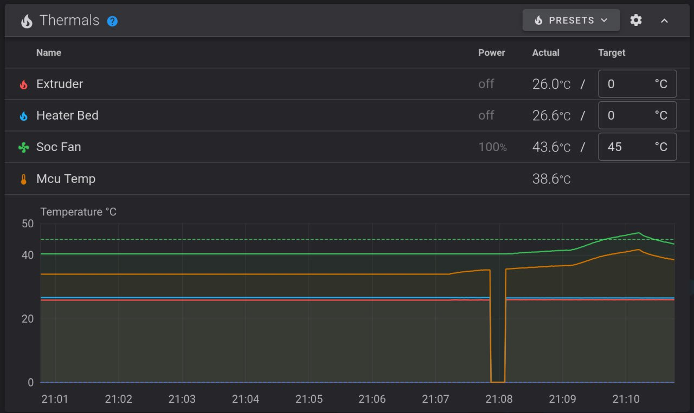

[↩️ Назад в главное меню](../readme.md)

---

# 📝 Список полезных макросов с пояснениями

> Упрощаем работу с макросами, формируя отдельный раздел с теми, которыми будем пользоваться

<h3 align="right"><a href="https://www.tinkoff.ru/rm/yakovleva.irina203/51ZSr71845" target="_blank">💝 Поддержать автора</a></h3>

---

## 😵 Проблема

После установки хелпер скрипта открывая вашу панель вы можете увидеть огромную "простыню" с всевозможными макросами. В основном они системные и не предполагают никакого взаимодействия с вами. **Они от системы для системы и про систему.** 

Чтобы не путаться и не захламлять интерфейс можно провести несколько простых операций:

---

## 🎯 Создание категории

**1** - открываем настройки  
**2** - нажимаем макросы  
**3** - добавить категорию  
**4** - вписываем название категории (у меня это "тесты")  
**5** - жмем сохранить



Теперь переходим в раздел **"вне категории"** и по следующему списку выбираем макрос и нажимаем на него и выбираем ему нашу свежесозданную категорию



---

## 🔧 Полезные макросы

### `BELTS_SHAPER_CALIBRATION`
Делает тест резонансов и создает график натяжения ремней

### `EXCITATE_AXIS_AT_FREQ`
Макрос тестирования на определенной частоте резонансов для выявления дефектов сборки



На картинке выше мы видим значения по умолчанию. На частоте **25 герц** в течении **10 секунд** трясем осью икс.  

**Для проведения теста:** ставим 3-5 секунд и перебором частот 25, 27, 30.. и т.д. находим частоту на которой вибрации максимальны. Далее ставим время теста 30-40 секунд и **пальпируя корпус** находим узел который вызывает резонанс. Внешним осмотром выявляем проблему (выкрутился болтик, отклеилась панель, недотянут винт и прочее)

### `INPUT_SHAPER_CALIBRATION`
Делает тест резонансов и записывает результат в `printer.cfg`

### `MOONRAKER_BACKUP_DATABASE`
Макрос для создания базы данных со статистикой печати (сколько всего потрачено материала, общего времени и прочего). Необходим для сохранения статистики перед обновлением, **если вам душу греют эти цифры** и вы хотите продолжить считать количество времени и пластика потраченного вашим принтером.

### `PID_HOTEND`
Это процедура калибровки, которая гарантирует, что принтер всегда будет поддерживать стабильную заданную температуру. PID (пропорционально-интегральная производная) используется в принтерах для поддержания стабильной температуры в хотенде.

### `RELOAD_CAMERA`
В принтерах креалити есть проблема с вебкамерами. Иногда, при высоких температурах в камере принтера, они могут выключаться от перегрева. Данный макрос поможет перегрузить сервисы камеры без перезагрузки по питанию.

### `TEST_RESONANCES_GRAPHS`
Делает тест резонансов и записывает его в график. Подробнее [**прочитать тут**](/shaper/readme.md)

### `WARMUP`
Данный макрос двигает печатную голову по осям икс и игрек. Предназначен для разгона консистентной смазки по валам после процедуры смазки и теста движений осей икс и игрек.

---

После этого ваша вебпанель приобретет более аккуратный вид и нужные вам макросы будут более наглядно расположены



---

## 💡 Разные мелочи

### Для K1SE

В K1SE ставить 9 пункт "Fans Control Macros" хелпер скрипта не получится потому что **нет ни заднего ни бокового вентилятора**. Но в этом пункте есть полезный макрос управления вентилятором обдувом материнской платы. 

Чтобы он у нас заработал достаточно открыть `printer.cfg` в свободном месте вставляем следующий блок:

```ini
[duplicate_pin_override]
pins: PC6, PB2, ADC_TEMPERATURE

[temperature_fan soc_fan]
pin: PB2
cycle_time: 0.0100
kick_start_time: 0.5
hardware_pwm: false
max_power: 1
shutdown_speed: 0
sensor_type: temperature_mcu
min_temp: 0
max_temp: 100
control: watermark
max_delta: 2
target_temp: 45.0
max_speed: 1.0
min_speed: 0.0
tachometer_pin:PC6
```

Не забываем сохранить и перезапустить конфигурацию. По итогу увидим так:



---

<div align="center">

**[↩️ Вернуться в главное меню](../readme.md)**

</div>
