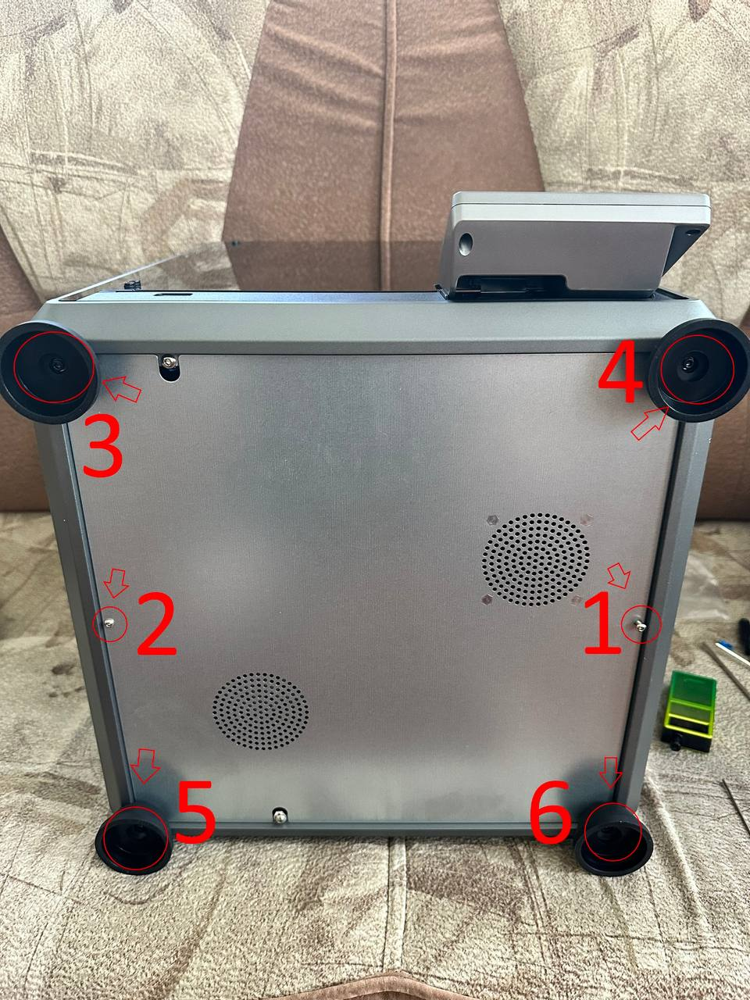
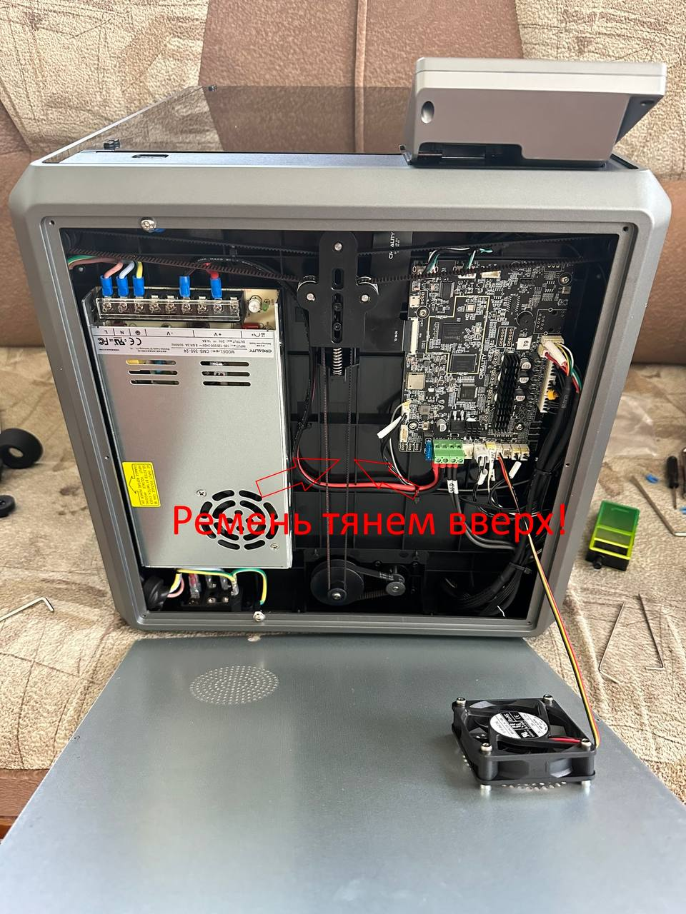

[↩️ Назад в главное меню](../readme.md)

---

# ⚠️ CREALITY K1 FAQ перед первым включением

> **УСТАРЕЛО** - но если вам попался этот пункт до того как вы вскрыли принтер, вполне возможно что вы избежите перекоса стола

<h3 align="right"><a href="https://www.tinkoff.ru/rm/yakovleva.irina203/51ZSr71845" target="_blank">💝 Поддержать автора</a></h3>

---

## 📑 Что делать ПЕРЕД первым включением

### 1️⃣ Подтянуть болты по кругу

### 2️⃣ Посмотреть прикручен ли вентилятор

### 3️⃣ Поднять стол перед включением

## ⚠️ ACHTUNG! ВНИМАНИЕ!

**Обязательно перед включением принтера в розетку**, проведите несложные мероприятия по предотвращению **ТЫР-ТЫР-ТЫР** столом о низ портала. 

Так как принтер имеет на борту Klipper, а Klipper имеет особенность опускать стол.

#### Порядок действий:

1. Аккуратно положите на спину принтер
2. Открутите болты как на скрине
3. Открыв крышку подвала, **не спешите** (можно повредить провод кулера)
4. Потяните правую сторону ремня вверх (стол должен туго подниматься вверх)
5. Подняв стол портала примерно до середины, можно собирать в обратной последовательности

**Только после данной манипуляции можно включать принтер!**

💀 **P.S.** Если вручную не поднять стол, то после ТЫР-ТЫР-ТЫР у вас проскочит ремень, а дальше придётся ослаблять его и перекидывать на нужные звенья.

---

### 4️⃣ Подтянуть пружину прижатия филамента

Если экструдер с светлой прокладкой - ничего делать не нужно.

### 5️⃣ Проверить ремни

### 6️⃣ Промазать хотенд термопастой

Использовать высокотемпературную термопасту, например **Thermal Grizzly Kryonaut** (до 350 градусов).

📖 Вот ссылка на объяснение как: https://t.me/crealityK1rus/8918

---

## 💡 Советы

### 1. Эскизы G-кода в PrusaSlicer

Если в PrusaSlicer добавить эскизы G-кода **"32×32, 300×300"** формат PNG, то на экране и в вебке будут показываться картинки моделей, что удобно.

### 2. Проблема пропусков шагов

Если есть проблема пропусков шагов - поджать направляющие в механизме подачи пластика по примеру с видео обзора **"Уголок Технаря"**.

### 3. Начальная калибровка

**Видео:** https://youtu.be/CsIAJgCAxFM

#### По калибровке стола:

1. Сначала опускаем стол в самый низ с экрана
2. Выключаем принтер
3. Снимаем низ
4. Снимаем ремни
5. Опускаем стол руками до конца
6. Закручиваем транспортировочные винты
7. Снова натягиваем ремни
8. Затягиваем натяжитель
9. Выполняем калибровку

**Готово!** ✔️

#### Для более точной калибровки:

Смотрим значения и уже сверху где держится сам стол на винтах откручиваем и подкладываем первый слой пластика куда нужно. **Я в итоге вывел стол с 0,6 до 0.15. Можно сказать в идеал.** 🎯

---

**[↩️ Вернуться в главное меню](../readme.md)**

