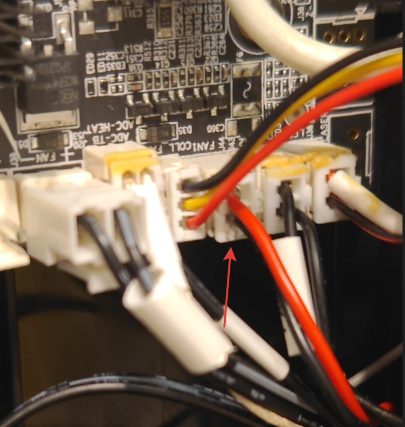
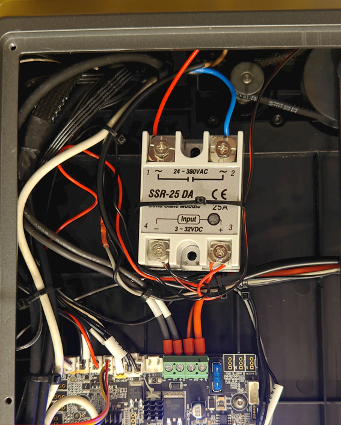
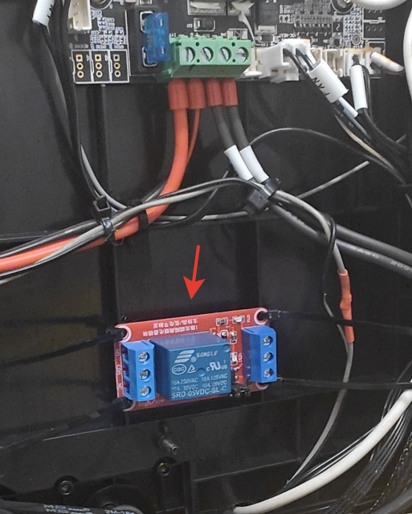
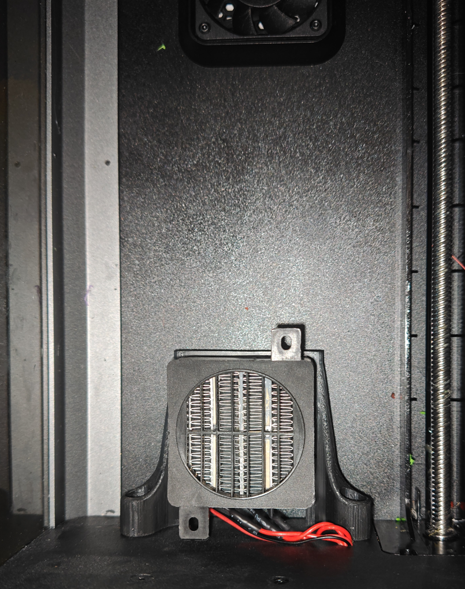
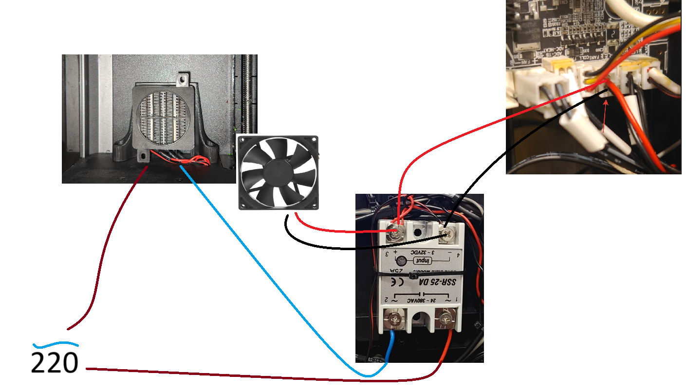
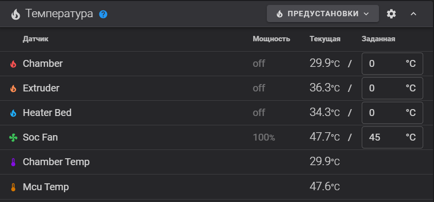

[↩️ Назад в главное меню](../../readme.md)

---

# 🔥 Подключение нагревателя камеры принтера

> Активная термокамера для печати ABS, ASA и других высокотемпературных пластиков

<h3 align="right"><a href="https://www.tinkoff.ru/rm/yakovleva.irina203/51ZSr71845" target="_blank">💝 Поддержать автора</a></h3>

---

## 📑 Оглавление

- [📖 Введение](#-введение)
- [🔧 Установка нагревателя](#-установка-нагревателя)
- [⚙️ Правка конфигурации](#️-правка-конфигурации)
- [⚠️ Небольшое послесловие](#️-небольшое-послесловие)

---

## 📖 Введение

При печати высокотемпературными пластиками одним из необходимых параметров для успешной печти является стабильно высокая температура в камере. 


Если вы установили Helper Script пункт **9** **chamber fan** - объедениние температурного датчика камеры принтера и заднего вентилятора.  При превышении пороговой температуры *по умолчанию 35 градусов* задний вентилятор включается высасывая излишне теплый воздух и подкачивая холодный, таким образом стабилизируя температуру печати. Однако этот пункт хорошо работает до температур 45-47 градусов, что далеко не всегда достаточно. Если ваша цель печать на температурах 50-60 градусов то данное руководство для вас.

Не забудьте почитать про 9 пункт Helper Script [тут](/random/menu.md)

---

## 🔧 Установка нагревателя

Нам потребуется несколько проводов, кримпер для обжима разьема, 2pin PH2.0 разьем от него 2 провода:



соблюдайте полярность! сверху на фото +(красный) снизу -(черный)


 пойдут они  до твердотельного реле например [SSR-25DA, Твердотельное реле 220В, коммутация AC 24-380В / 25А, управление DC 3-32В](https://www.ozon.ru/product/ssr-25da-tverdotelnoe-rele-220v-kommutatsiya-ac-24-380v-25a-upravlenie-dc-3-32v-keramicheskiy-korpus-1630953294/)



сперва я хотел использовать простые реле типа таких:



но после того как проработав пару минут умерло 2 штуки я решил что лучше один раз заплатить за нормальное реле. 

я использовал нагреватель с вентилятором такой
с креплением [таким](ptcheater_v1.step) 



Но не могу его рекомендовать так как работает он из рук вон плохо,  однако в сети уже есть несколько проектов которые на вид внушают доверие.  например [этот](https://www.printables.com/model/863675-nexgen3d-chamber-heater)  

Cуть особо не меняется, у нас есть выход на 24 вольта на наш вентилятор и подключаемое реле которое коммутирует цепь 220 вольт. 220 вольт удобно взять на клеммах входа блока питания. 

При установке нагревателя, не забывайте о габаритных размерах стола, проверяйте чтобы оставался зазор как от стола до нагревателя, так и от входа вентилятора до стенки принтера.


⚠️ **ВАЖНО! БЕЗОПАСНОСТЬ!**  
**Все работы по подключению проводятся на ОТКЛЮЧЕННОМ питании принтера. Не выключателем! Отключайте кабель физически!** 
- ⚡ Спички детям не игрушки и высокое напряжение тоже
- 🔌 Изолируйте соединения
- ✋ Не трогайте контакты и провода при подключенном принтере



*Если кто-то перерисует схему буду благодарен, художник из меня так себе.*

---

## ⚙️ Правка конфигурации
К сожалению править файл который нам нужен мы не сможем и первым делом нам придется зайти через ssh в наш принтер и вызвав меню helper script 

```
sh /usr/data/helper-script/helper.sh
```
Выбираем пункт `2 remove`

и удаляем 9 пункт `Fans Control Macros`

выходим из консоли.

Не переживайте, часть функционала макроса мы скоро вернем с помощью наших файлов.

далее нам надо в вебпанели найти файл `printer.cfg` и внести в него несколько изменений. 

Находим такой блок и удаляем его:
*или перед строчками ставим знак `#` чтобы закоментировать.*
```
[duplicate_pin_override]
pins: PC0, PC5

[temperature_fan chamber_fan]
pin: PC0
cycle_time: 0.0100
hardware_pwm: false
max_power: 1
shutdown_speed: 0
sensor_type: EPCOS 100K B57560G104F
sensor_pin: PC5
min_temp: 0
max_temp: 70
control: watermark
max_delta: 2
target_temp: 35.0
max_speed: 1.0
min_speed: 0.0
```

После строки `[include Helper-Script/KAMP/KAMP_Settings.cfg]`

вписываем:

```
[include fan_control.cfg]
```

сохраняем файл без перезагрузки. 

скачиваем файл [fan_control.cfg](/random/heater_chamber/fan_control.cfg) 

или если у вас проблемы со скачиванием то 
создаем новый файл в корневой папке конфига(рядом с `printer.cfg`) и называем его `fan_control.cfg`

открываем его для редактирования и копируем туда следующий блок:

```
########################################
# Fans Control
########################################

[respond]

[duplicate_pin_override]
pins: PC5, PB2, PC6, ADC_TEMPERATURE

[temperature_fan soc_fan]
pin: PB2
cycle_time: 0.0100
kick_start_time: 0.5
hardware_pwm: false
max_power: 1
shutdown_speed: 0
sensor_type: temperature_mcu
min_temp: 0
max_temp: 100
control: watermark
max_delta: 2
target_temp: 45.0
max_speed: 1.0
min_speed: 0.0
tachometer_pin:PC6

[heater_generic chamber]
heater_pin:PA0
max_power:1.0
sensor_type: EPCOS 100K B57560G104F
sensor_pin: PC5
control: watermark
max_delta: 1
min_temp:-100
max_temp:65

[verify_heater chamber]
max_error: 900
check_gain_time: 300
hysteresis: 50
heating_gain: 1


[gcode_macro M141]
gcode:
    
         
        SET_HEATER_TEMPERATURE HEATER=chamber TARGET={params.S|default(0)}
    


[gcode_macro M191]
description: Wait for Chamber Temperature to heat up
gcode:
  
  
  
    M141 S{s}
  
  
    M140 S100
    M106 P2 S210 # подключение боковой улитки для лучшей конвекции в камере
    RESPOND TYPE=command MSG="Waiting for the bed to heat up the chamber..."
    TEMPERATURE_WAIT SENSOR="heater_generic chamber" MINIMUM={s-2}
    RESPOND TYPE=command MSG="Chamber target temperature reached: {s}°C"
    M107 P2 S0 # отключение улитки при достижении нужной температуры
    M140 S{s}
  


[gcode_macro M106]
gcode:
  
  
  
  
    
    
      
    
  
  
    
  
    
  
  
    
      
      
        SET_GCODE_VARIABLE MACRO=Qmode VARIABLE=fan0_value VALUE={printer["gcode_macro PRINTER_PARAM"].fan0_min + value}
        
          
        
          
        
      
        
      
    
    
      
      
        SET_GCODE_VARIABLE MACRO=Qmode VARIABLE=fan1_value VALUE={printer["gcode_macro PRINTER_PARAM"].fan1_min + value}
        
          
        
          
        
      
        
      
    
    
      
      
        SET_GCODE_VARIABLE MACRO=Qmode VARIABLE=fan2_value VALUE={printer["gcode_macro PRINTER_PARAM"].fan2_min + value}
        
          
        
          
        
      
        
      
    
  
  
    
  
  
    
  
  SET_PIN PIN=fan{fan} VALUE={value}
```

сохраняем, закрываем. Переходим к файлу `gcode_macro.cfg`

ищем макрос который начинается с **[gcode_macro M106]** удаляем либо закомментируем все строки в этом блоке.
также поступаем с макросом **[gcode_macro M141]**. сохраняем и теперь уже с перезагрузкой. если все правильно то ваша панель температур будет выглядеть как то так:

 

На данный момент задний вентилятор теперь просто вентилятор, но вы всегда можете предложить как его использовать в [нашем чате Telegram](https://t.me/crealityK1rus). 

---

## ⚠️ Небольшое послесловие

В данном руководстве температура нагрева ограничена 65 градусами. Никто вам не сможет помешать поставить и больше, но помните. уже после 63 градусов нагрева камеры у пользователей начинаются проблемы: 
  
 * Из-за недостаточного обдува вентилятора радиатора возможны пробки. 
  
 * Двигатели всех осей работают при повышенных температурах на которые не расчитывал производитель.

 * Из-за нагрева дна принтера это тепло передается на материнскую плату и блок питания,  советую распечатать [крепление вентилятора материнской платы](https://www.printables.com/model/540070-motherboard-fan-mount-mk2-collection-creality-k1-s) или [такое](https://www.printables.com/model/540070-motherboard-fan-mount-mk2-collection-creality-k1-s)  и удалить металлическую крышку дна принтера для обеспечения лучшего охлаждения.

  * В материнской плате которая управляет мотором фидера и установлена в печатной голове принтера возможны сбои изза перегрева.

 * Учитывайте что обдув ваших моделей будет происходить внутри замкнутого пространства и той же повышенной температурой. Увеличивайте процент обдува нависаний.

  В составе кода есть два макроса контроля температуры:
  
  **M141** как использовать контроль температуры в слайсере описание тут - 9 пункт Helper Script [тут](/random/menu.md) 

 **M191** В отличии от обычного макроса который включает нагрев стола, мы включаем и стол и нагреватель и вентилятор боковой улитки для лучшей конвекции воздуха. Не начинаем печать до того как не набрали целевую температуру.

---

<div align="center">

**[↩️ Вернуться в главное меню](../../readme.md)**

</div>