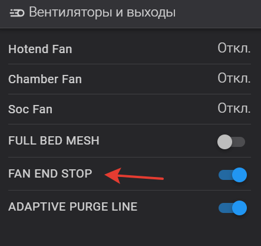
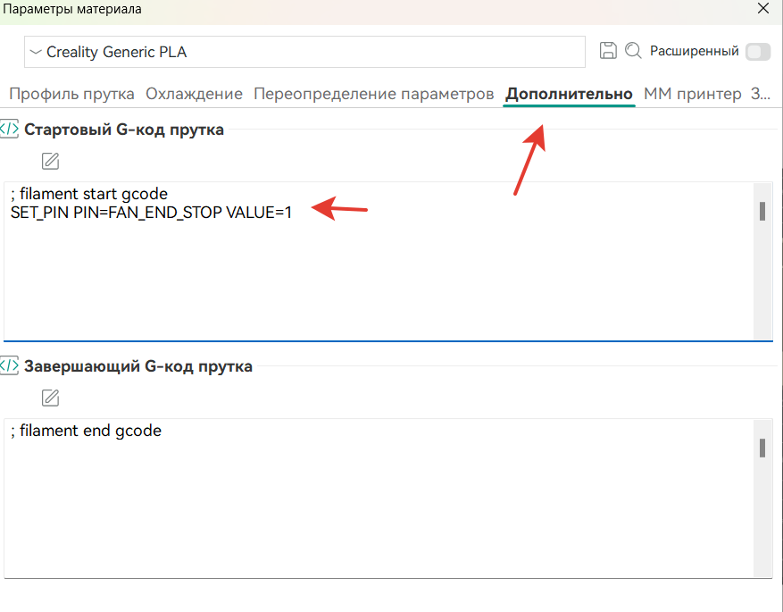

[↩️ Назад в главное меню](../readme.md)

---

# 📌 Добавление функционала на основе virtual_pins

> Пример отключения вентиляторов в конце печати

<h3 align="right"><a href="https://www.tinkoff.ru/rm/yakovleva.irina203/51ZSr71845" target="_blank">💝 Поддержать автора</a></h3>

---

## ⚠️ Предупреждение

Тут попросили меня реализовать не очень полезную идею по отключению вентиляторов в конце печати. Ну так-то идея так себе, но **раз звезды зажигают - значит это кому-то нужно.** 🌟

Исключительно как пример ну и тем кому это надо. *(Сами себе злобные Буратино. Я предупредил.)* 🤷

---

## 🎯 Задача

Необходимо дать команду в слайсере для определенного пластика, чтобы при окончании печати он не включал обдув а просто заканчивал печать.

---

## 🔧 Реализация

### Сам макрос END_PRINT

Стандартно выглядит так:

```ini
[gcode_macro END_PRINT]
gcode:
  Qmode_exit
  EXCLUDE_OBJECT_RESET
  PRINT_PREPARE_CLEAR
  M220 S100
  SET_VELOCITY_LIMIT ACCEL=5000 ACCEL_TO_DECEL=2500
  TURN_OFF_HEATERS
  M107 P1
  M107 P2
  END_PRINT_POINT
  WAIT_TEMP_START
  M84
```

Часть отвечающая за старт работы кулеров - это `WAIT_TEMP_START`. Необходимо обрамить ее условиями и для этого применим модуль **virtual_pins**.

⚠️ **Если у вас по каким-то причинам нет этого модуля** - это легко исправить: достаточно в `/klippy/extras/` добавить [virtual_pins.py](virtual_pins.py) и добавить в `printer.cfg` раздел `[virtual_pins]`

### Шаг 1: Добавляем кнопку в printer.cfg

⚠️ **Важно!** Код необходимо вставить **после** раздела `[virtual_pins]`

```ini
[output_pin FAN_END_STOP]
pin: virtual_pin:FAN_END_STOP_pin
value: 0
```

*Фантазии у меня нет, так что название выдумал такое, какое пришло в голову.* 😄

Сохраняем, перегружаем, смотрим. Должно получиться как-то так:



По умолчанию он у нас будет выключен.

### Шаг 2: Обрамляем макрос условиями

Теперь идем в `gcode_macro.cfg`, находим `END_PRINT` и обрамляем макрос `WAIT_START` условиями:

```ini
[gcode_macro END_PRINT]
gcode:
  Qmode_exit
  EXCLUDE_OBJECT_RESET
  PRINT_PREPARE_CLEAR
  M220 S100
  SET_VELOCITY_LIMIT ACCEL=5000 ACCEL_TO_DECEL=2500
  TURN_OFF_HEATERS
  M107 P1
  M107 P2
  END_PRINT_POINT
  
    WAIT_TEMP_START
  
    SET_PIN PIN=FAN_END_STOP VALUE=0
  
  M84
```

### 💡 Как это работает:

По умолчанию мы назначили значение нашей кнопки **0** и проверив условия когда у нас значение равно 0 - принтер продолжит выполнение макроса и выполнит `WAIT_START`. Но если мы переведем нашу кнопку в значение **1** - мы эту строку перепрыгнем. 

Чтобы после печати кнопка наша вернулась в исходное состояние в конце дописываем значения кнопки 0.

---

## 📝 Использование в слайсере

Теперь если мы включим нашу виртуальную кнопку - в конце печати кулер головы не будет дуть на наш хотенд. Но хотелось бы это внести в слайсер. **Да легко!**

В Orca Slicer открываем профиль нужного пластика и лезем на вкладку **"Дополнительно"** и вписываем переключение нашей кнопки.

💡 **Кстати**, синтаксис ее нажатия можно всегда подсмотреть в консоли Klipper.

Вписываем:

```gcode
SET_PIN PIN=FAN_END_STOP VALUE=1
```

Получится как-то так:



**Всё. Готово.** ✅

---

<div align="center">

**[↩️ Вернуться в главное меню](../readme.md)**

</div>
