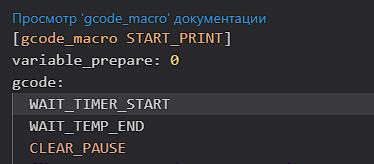
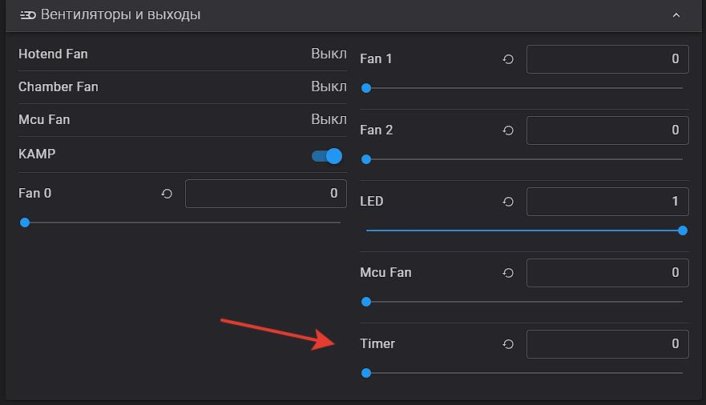
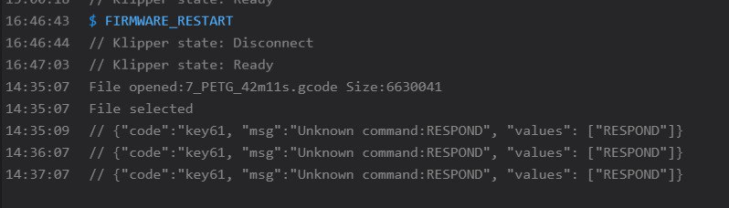

[↩️ Назад в главное меню](../readme.md)

---

# ⏰ Таймер отложенной печати

> Частный случай, однако пока его делал нашел один интересный файлик который потом стал частью Helper Script

<h3 align="right"><a href="https://www.tinkoff.ru/rm/yakovleva.irina203/51ZSr71845" target="_blank">💝 Поддержать автора</a></h3>

---

## 💡 Зачем это нужно?

Предположим время вечер, просыпаться поутру лень, некогда, или, например, хочу чтоб принтер начал печатать в три ночи чтоб к утру заменить филамент и к обеду распечатать... так вот, **нет у него такой функции чтоб по будильнику печатать**. 

Можно конечно через HOME ASSISTANT и прочие умные домики, но это вроде как не спортивно... 🏃

---

## ⚙️ Установка

⚠️ **Внимание!** Так как в новых версиях Helper Script уже этот модуль есть, то **пункт 1 пропускаем**.

### Шаг 1: Установка virtual_pins (если нужно)

Заходим по SSH на принтер и вписываем:

```bash
cd /usr/share/klipper/klippy/extras
wget --no-check-certificate https://raw.githubusercontent.com/Tombraider2006/K1/main/random/virtual_pins.py
```

💡 **Если ставили Helper Script и пункт 6 в нем** - это можно пропустить, я уже инициировал добавку virtual pins в Helper Script.

### Шаг 2: Правка printer.cfg

Открываем `printer.cfg` например через вебпанель и вписываем в любое свободное место:

```ini
[virtual_pins] # если хелпер скрипт установлен то эту строку стоит закоментировать
[output_pin timer]
pin: virtual_pin:timer_pin
pwm: True
value: 0
scale: 1440


[delayed_gcode wait_timer] 
 # initial_duration: 2.
gcode:
    
    
    
    
    
    
      RESPOND MSG="Waiting... {WAIT_ROUNDED} minutes remaining."
      
      SET_PIN PIN=timer VALUE={WAIT_ROUND_COUNT}
      UPDATE_DELAYED_GCODE ID=wait_timer DURATION=60
      WAIT_TIMER_START
    
     RESPOND MSG="Wait Time End"
     WAIT_TIMER_END	
    
 

[gcode_macro WAIT_TIMER_START]
gcode:
  UPDATE_DELAYED_GCODE ID=wait_timer DURATION=1
  
  SET_PIN PIN=LED VALUE=0.25
  G4 P14000
  SET_PIN PIN=LED VALUE=0.5
  G4 P1000
  

[gcode_macro WAIT_TIMER_END]
gcode:
  UPDATE_DELAYED_GCODE ID=wait_timer DURATION=0
  SET_PIN PIN=LED VALUE=1
```

Сохраняем без перезагрузки.

### Шаг 3: Правка Start_Print.cfg

В папке `/Helper-Script/KAMP` ищем файл `Start_Print.cfg` и сразу после строки `gcode:` нажимаем Enter и вписываем:

```
WAIT_TIMER_START
```

Получится как-то так:



Сохраняем, перегружаемся.

---

## ✅ Результат

Теперь в интерфейсе появился новый элемент:



### Как использовать:

1. Перед печатью введите в окошко количество минут (вплоть до **1440** = 24 часа)
2. Печать стартует только после этого времени
3. Всё это время принтер будет иногда вам поморгивать светом подсветки раз в 14 секунд

💡 **Полезно знать:**
- Если передвинете ползунок на новое значение - в течении минуты обновится значение таймера
- Если скинуть на ноль - то печать начнется как только пройдет минута или меньше

---

## ⚠️ Решение проблем

Если при запуске появилась вот такая ошибка:



В файле `printer.cfg` добавьте в любом месте раздел:

```ini
[respond]
```

### P.P.S.

Если вы не можете отредактировать файл `/Helper-Script/KAMP/Start_Print.cfg` - это от того что это у вас не папка, а ссылка на папку. 

**Варианты:**
1. Отредактировать `/usr/data/KAMP-for-K1-Series/Configuration/Start_Print.cfg`
2. ИЛИ всю папку переписать в `/usr/data/printer_data/config/Helper-Script/KAMP` удалив ссылку на папку

---

## 🙏 Благодарности

[**Thank a lot for assistance in writing the macro - Guilouz**](https://github.com/Guilouz)

---

<div align="center">

**[↩️ Вернуться в главное меню](../readme.md)**

</div>
