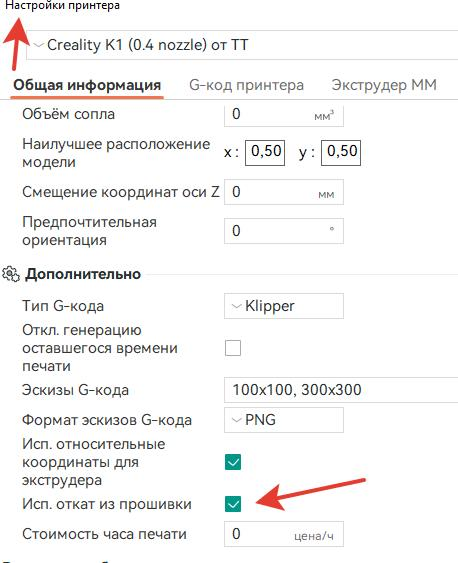
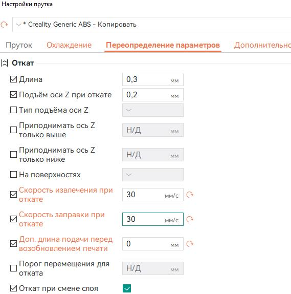
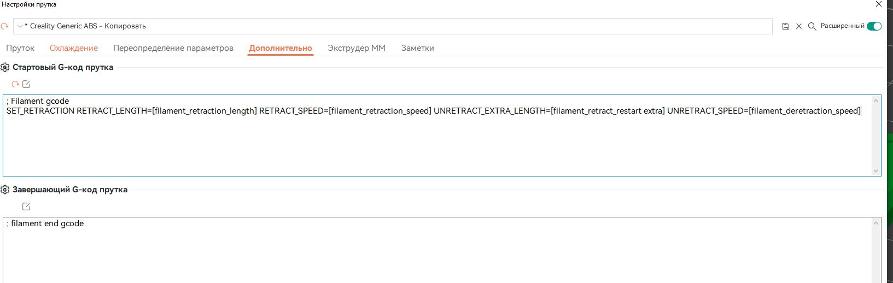
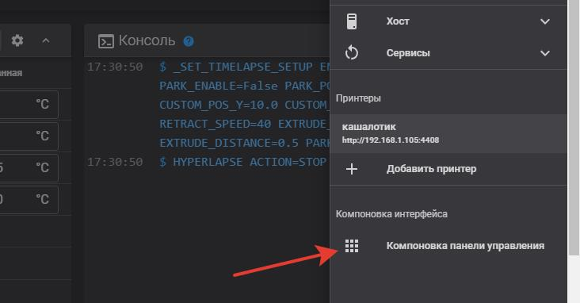
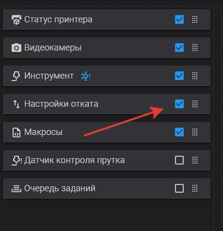
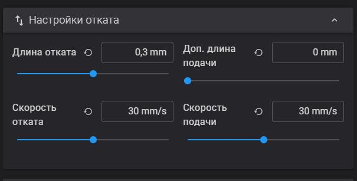
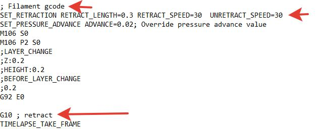

[↩️ Назад в главное меню](../readme.md)

---

# 🔄 Управление ретрактом во время печати

> Динамическая настройка ретракта через прошивку Klipper прямо в процессе печати

<h3 align="right"><a href="https://www.tinkoff.ru/rm/yakovleva.irina203/51ZSr71845" target="_blank">💝 Поддержать автора</a></h3>

---

## 📋 Описание

В прошивке Klipper возможно управлять ретрактом во время печати. Это полезно, если пластик оказался влажным и начал тянуть "сопли" уже в процессе длительной печати.

⚠️ **Важно:** Эта функция не для всех - требует настройки слайсера и прошивки.

---

## ⚙️ Настройка OrcaSlicer

### Шаг 1: Включение ретракта из прошивки

Зайдите в настройки принтера и поставьте галку **"Использовать откат из прошивки"**



### Шаг 2: Добавление кода в START_PRINT

Добавьте в стартовый код принтера:

```gcode
SET_RETRACTION RETRACT_LENGTH=[retraction_length] RETRACT_SPEED=[retraction_speed] UNRETRACT_EXTRA_LENGTH=[retract_restart_extra] UNRETRACT_SPEED=[deretraction_speed]
RESPOND TYPE=command MSG="Retraction length set to [retraction_length]mm" 
RESPOND TYPE=command MSG="Retract speed set to [retraction_speed]/[deretraction_speed]mm/c"
```



⚠️ **Не забудьте:** Указывайте значение отката для каждого пластика при настройке профиля!

**Пример настройки:**



---

## 🔧 Настройка Klipper

### Шаг 3: Добавление в printer.cfg

Откройте файл `printer.cfg` и добавьте раздел:

```ini
[firmware_retraction]
retract_length: 0.43  # Безопасное значение для вашего основного пластика
retract_speed: 30
unretract_extra_length: 0
unretract_speed: 30
```

### Шаг 4: Включение виджета в интерфейсе

Если после перезагрузки не появился раздел управления ретрактом:

1. Нажмите на **три точки** в правом верхнем углу
2. Найдите раздел:



3. Внутри найдите **"Настройки отката"** и поставьте галочку:



---

## ✅ Результат

Теперь у вас появится виджет управления ретрактом прямо во время печати:



---

## 🧪 Проверка настройки

Перед началом печати проверьте корректность настройки:

1. Нарежьте модель и сохраните G-code на диск
2. Откройте файл в текстовом редакторе
3. Найдите команду `START_PRINT`
4. Убедитесь, что есть:
   - Команда **`SET_RETRACTION`** с цифровыми значениями
   - Команда **`G10`** (откат обрабатывается прошивкой)



---

<div align="center">

✅ **Готово!** Теперь вы можете регулировать ретракт в реальном времени

**[↩️ Вернуться в главное меню](../readme.md)**

</div>
