[↩️ Назад в главное меню](../readme.md)

---

# 📟 Датчик филамента SFS 2.0 для K1C / K1 / K1 Max

> Когда у нас не просто датчик обрыва филамента, а еще с реакцией если филамент остановился

<h3 align="right"><a href="https://www.tinkoff.ru/rm/yakovleva.irina203/51ZSr71845" target="_blank">💝 Поддержать автора</a></h3>

---

## 📑 Оглавление

- [📖 Описание](#-описание)
- [🔧 Способ №1: Пайка к материнской плате](#-способ-1-пайка-к-материнской-плате)
- [⚡ Способ №2: Только штатная проводка](#-способ-2-только-штатная-проводка)

---

## 📖 Описание

При печати на 3D принтере решил обезопасить себя не только паузой при окончании филамента, но также в случае перехлеста или другой причине остановки подачи пластика в экструдер.

Для этого был приобретен датчик филамента BTT SFS v2.0

**Проблемы, которые решает:**
- ✅ Окончание филамента
- ✅ Пробка / запутывание филамента  
- ✅ Окончание катушки с загнутым филаментом

---

## 🔧 Способ №1: Пайка к материнской плате

### 🎯 Преимущества:
- Два датчика (движение + обрыв)
- Максимальная надежность

### 🛠️ Что потребуется:

- Датчик BTT SFS v2.0
- SMD резистор 0402 на 100 Ом (можно 0805)
- 3-пиновый разъём PH2.0 (можно XH2.54, но придется подогнуть ножки)
- Кримпер для обжима
- Паяльник

### Шаг 1: Подготовка проводки

Так как короб с проводами вскрывать не хотелось, то отрезал контакты от купленного датчика с одной стороны (где их 2), просунул между проводами родного датчика и вытянул провода от родного датчика филамента, заодно протянув провода для нового.

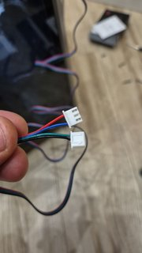

*Вот это отрезал*

### Шаг 2: Пайка резистора

Берем SMD резистор 0402 на 100 Ом и припаиваем его сюда:

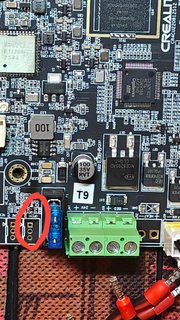

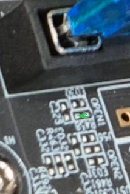

*На этой фотографии видно лучше.*

**Проверка:** Берем тестер и замеряем сопротивление - должно быть **100 Ом**

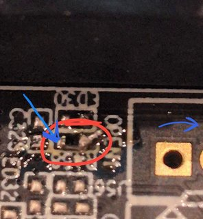

Один щуп сюда, второй на дальнее отверстие разъема.

### Шаг 3: Подключение

Далее берем 3-пиновый разъём PH2.0:

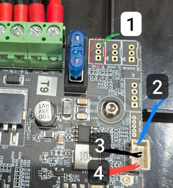

Соединение делаем так - цвета линий соответствуют цвету проводов от датчика:

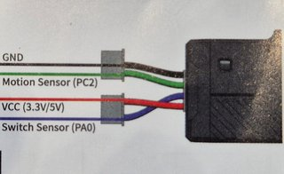

### Шаг 4: Конфигурация Klipper

Для принтера на Klipper надо закомментировать/удалить код родного датчика и вписать:

```ini
[filament_switch_sensor filament_sensor]
switch_pin: ^PC15
pause_on_runout: False
runout_gcode:
 PAUSE # [pause_resume] is required in printer.cfg
 M117 filament_switch_runout
insert_gcode:
 M117 Filament switch inserted


[filament_motion_sensor encoder_sensor]
switch_pin: ^PA7
detection_length: 5.3
extruder: extruder
pause_on_runout: False
runout_gcode:
 PAUSE # [pause_resume] is required in printer.cfg
 M117 filament_encoder_runout
insert_gcode:
 M117 Filament encoder inserted
```

Перезагрузить прошивку и всё должно работать.

**Можно поменять синий и зеленый провода местами**, при этом не забудьте поменять пины в вышеуказанном коде.

### 📏 Про длину (detection_length)

Параметр `detection_length: 5.3` отвечает за длину в мм за которое должен поступить сигнал от энкодера. Если этого не происходит, датчик дает сигнал о том, что нить перестала двигаться.

Производитель рекомендует **2.88**, но по факту подбора у меня перестали быть ложные срабатывания только на **5.3**

### 🔌 Про подтяжки

В процессе тестирования выяснилось, что нужна подтяжка обоих сигнальных пинов к питанию. 

**Есть 2 варианта:**
1. В конфиге перед именем пина дописать `^` (сейчас в коде выше так и указано)
2. Напаять внутрь SFS физические подтяжки из резисторов 10кОм

По совету сообщества пошел по второму пути, но **будет работать и первый способ**.

Для способа с резисторами в коде должно быть так:
```ini
[filament_switch_sensor filament_sensor]
switch_pin: PC15
```
```ini
[filament_motion_sensor encoder_sensor]
switch_pin: PA7
```

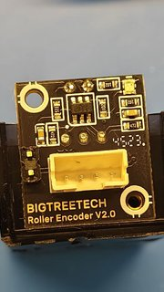  
*Вид датчика с лицевой стороны*

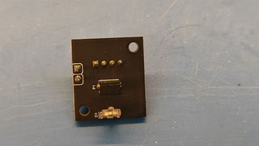  
*С обратной стороны (еще без резисторов)*

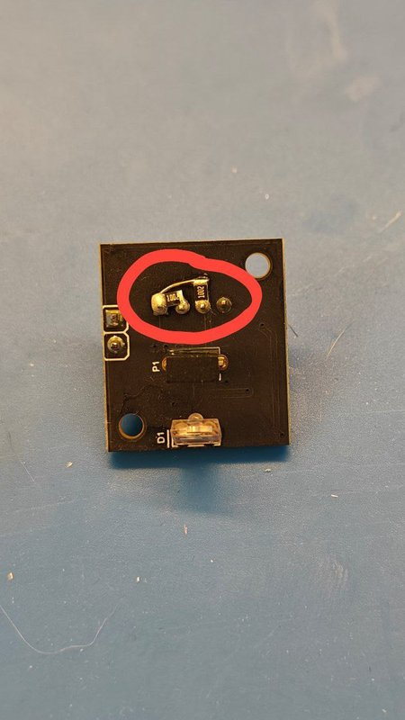  
*Результат*

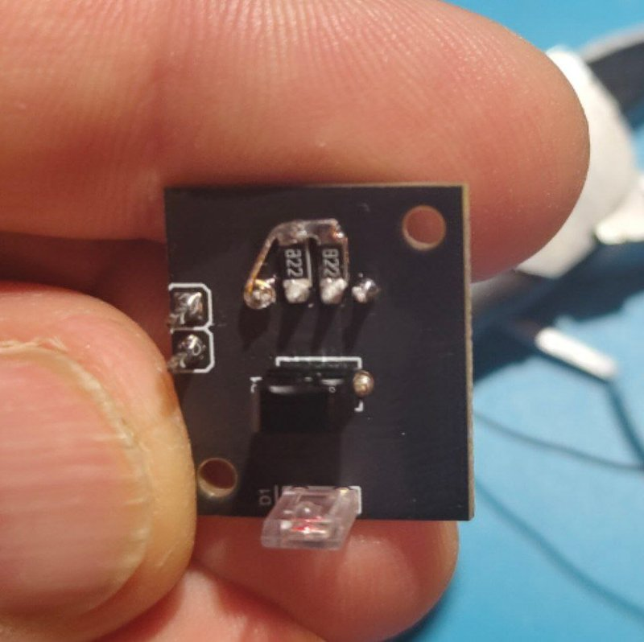  
*Можно и так*

[Спасибо за мануал](https://telegra.ph/Datchik-filamenta-sfs-20-dlya-k1c-09-30)

---

## ⚡ Способ №2: Только штатная проводка

### 🎯 Преимущества:
- Не нужно лезть в материнскую плату
- Не нужна пайка
- Простая установка

### ⚠️ Недостатки:
- Будет гореть иконка "не вставлен филамент" на экранчике принтера (так как мы сменили тип датчика)
- **Но это будет раздражать только законченных перфекционистов**, остальные рыжие 4на4 пикселя переживут 😄

### Разводка проводов:

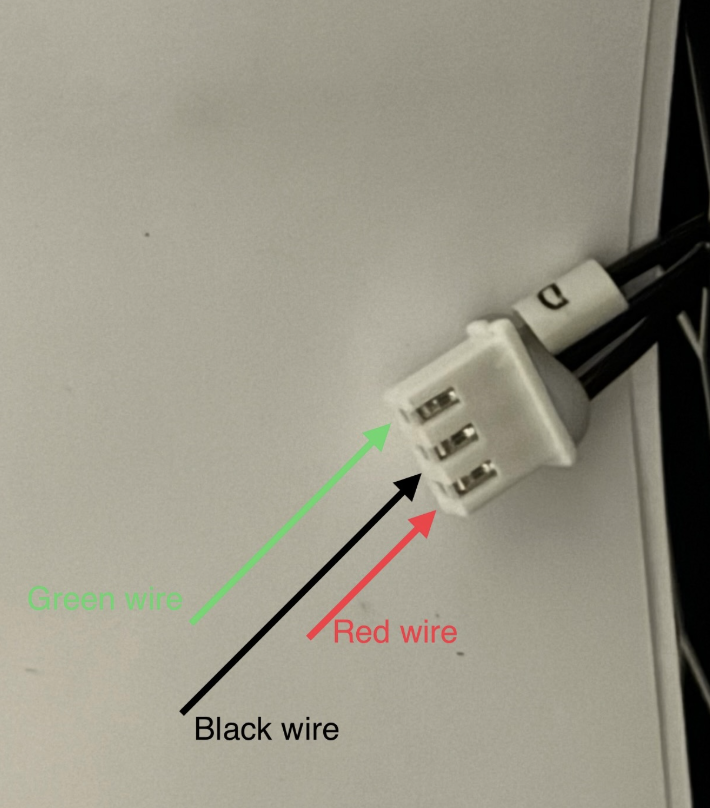

На материнской плате:

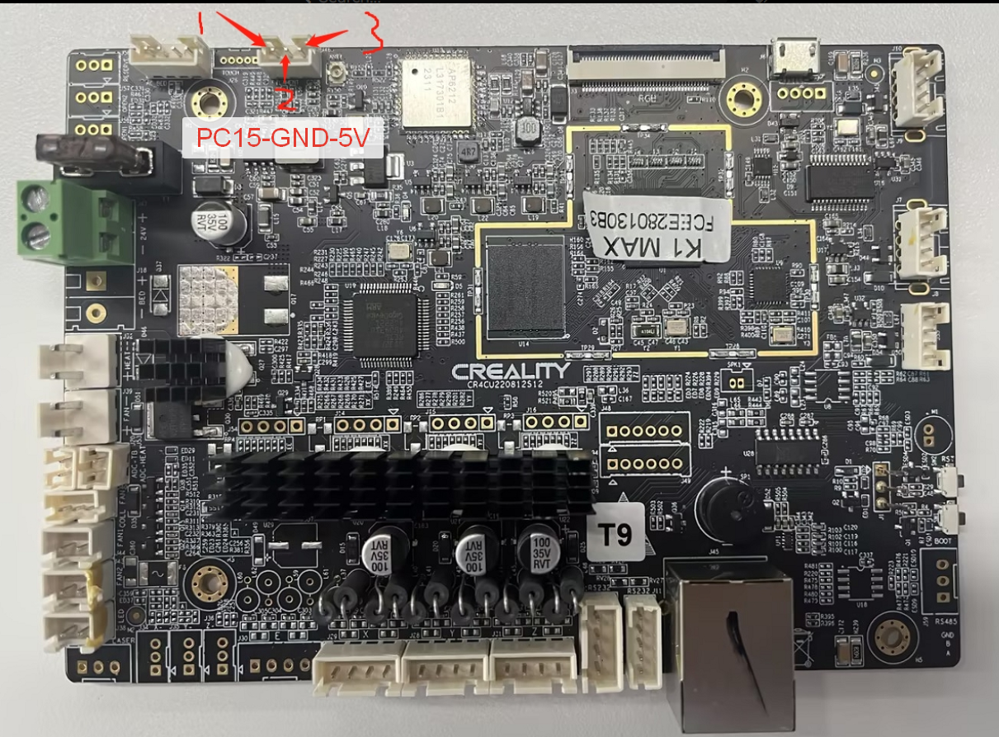

### Конфигурация:

Заходим в `printer.cfg` и ищем строки:

```ini
[filament_switch_sensor filament_sensor]
pause_on_runout: true
switch_pin: !PC15
runout_gcode:
  
    G91
    G0 E30 F600
    G90
  
```

Эти строки **стираем** и вписываем вместо них:

#### Вариант А: С бипером (для K1 / K1 Max)

```ini
[filament_motion_sensor filament_sensor]
detection_length: 5.3
extruder:extruder
pause_on_runout: true
switch_pin: ^PC15
runout_gcode:
  RESPOND TYPE=command MSG="Filament runout/blocked!"
  UPDATE_DELAYED_GCODE ID=sfs_alarm DURATION=1
insert_gcode:
  RESPOND TYPE=command MSG="Filament inserted"
  UPDATE_DELAYED_GCODE ID=sfs_alarm DURATION=0

[delayed_gcode sfs_alarm]
# initial_duration: 2
gcode:
  beep # звуковой сигнал если заканчивается филамент во время печати.
```

Строка с `beep` - если у вас K1SE, вам не нужна (у вас нет пищалки). Также будет выдавать ошибку если вы не устанавливали Buzzer Support через Helper Script.

#### Вариант Б: С морганием подсветки (для K1SE без бипера)

Мне тут не спалось и решил я что пользователям K1SE как-то обидно будет что нет у них никакой сигналки при паузе по движению, поэтому немного переписал модуль чтобы моргал подсветкой 3 раза. **Не супер, но хоть что-то.**

```ini
[filament_motion_sensor filament_sensor]
detection_length: 5.3
extruder:extruder
pause_on_runout: true
switch_pin: ^PC15
runout_gcode:
  RESPOND TYPE=command MSG="Filament runout/blocked!"
  UPDATE_DELAYED_GCODE ID=sfs_alarm DURATION=1
insert_gcode:
  RESPOND TYPE=command MSG="Filament inserted"
  UPDATE_DELAYED_GCODE ID=sfs_alarm DURATION=0
  SET_PIN PIN=LED VALUE=1

[delayed_gcode sfs_alarm]
# initial_duration: 0
gcode:
  SET_PIN PIN=LED VALUE=0
  G4 P500
  SET_PIN PIN=LED VALUE=1
  G4 P1000
  SET_PIN PIN=LED VALUE=0
  G4 P500
  SET_PIN PIN=LED VALUE=1
  G4 P1000
  SET_PIN PIN=LED VALUE=0
  G4 P500
  SET_PIN PIN=LED VALUE=1
  G4 P1000
```

### Установка:

Модель для установки [скачать тут](BTT_SFS.zip) - крепится штатными винтами из комплекта к креплению.

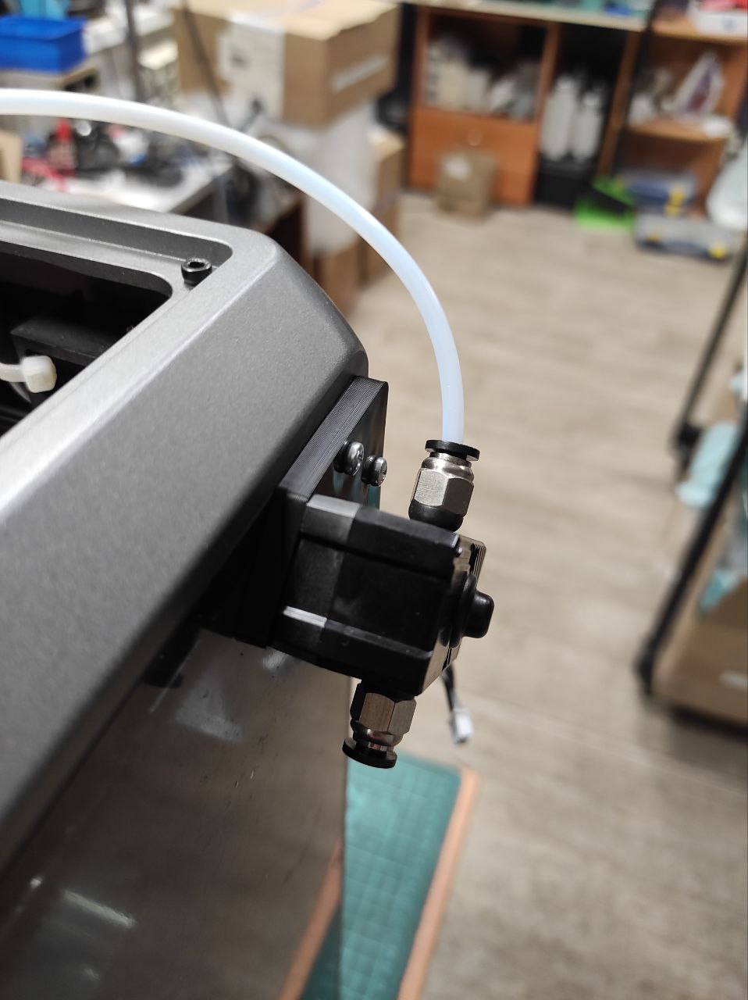

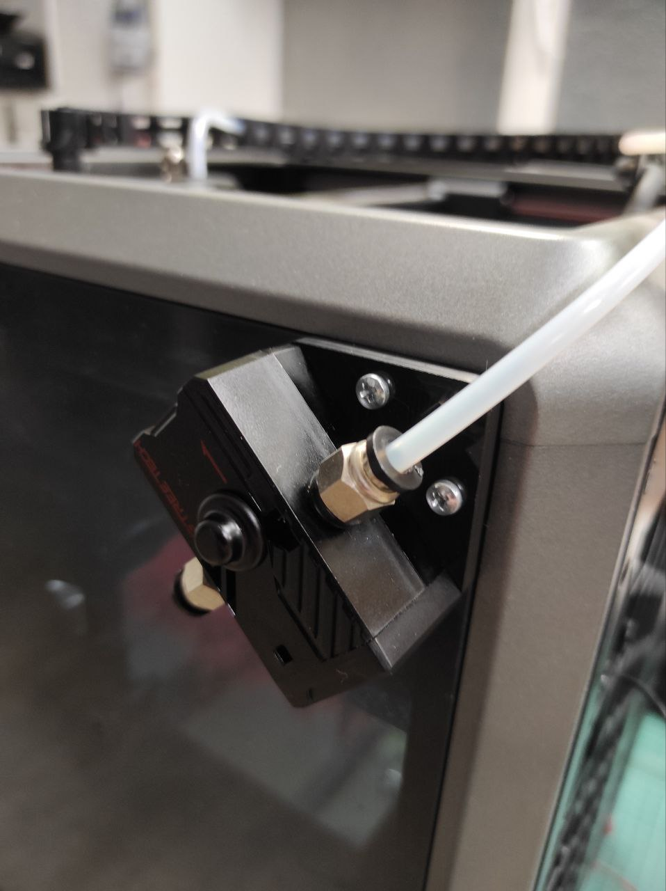

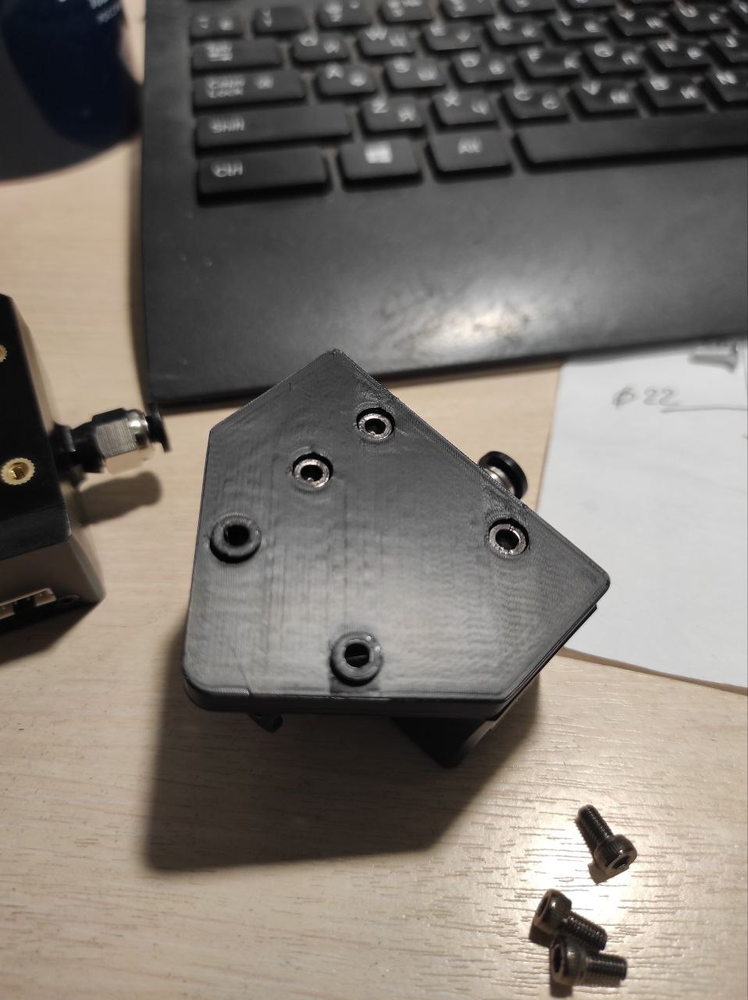

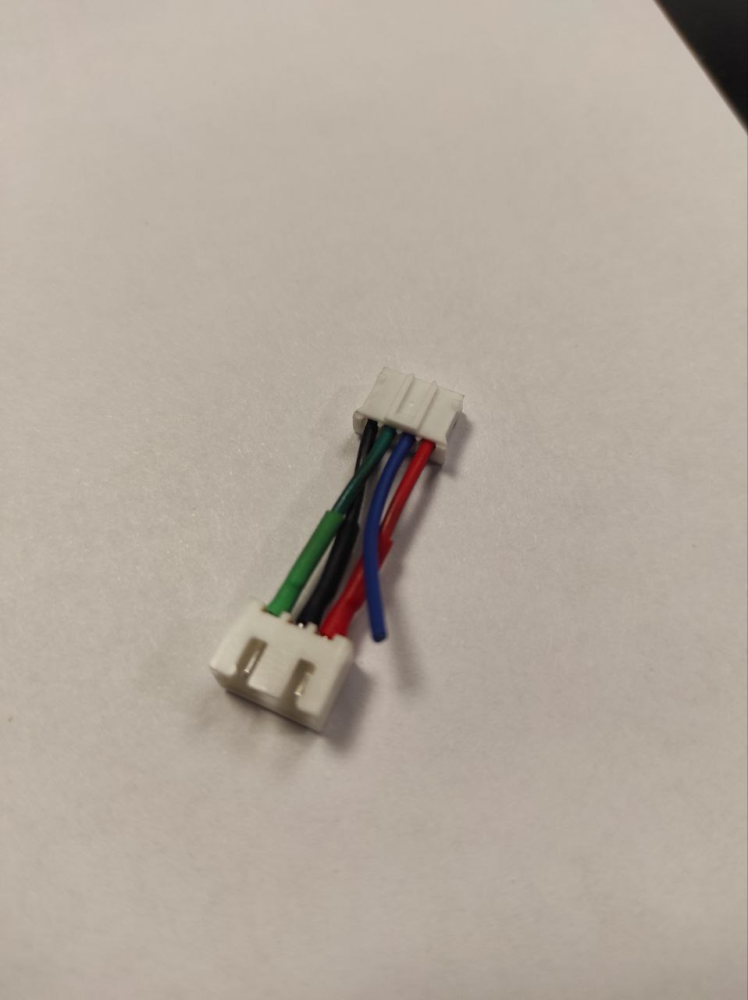

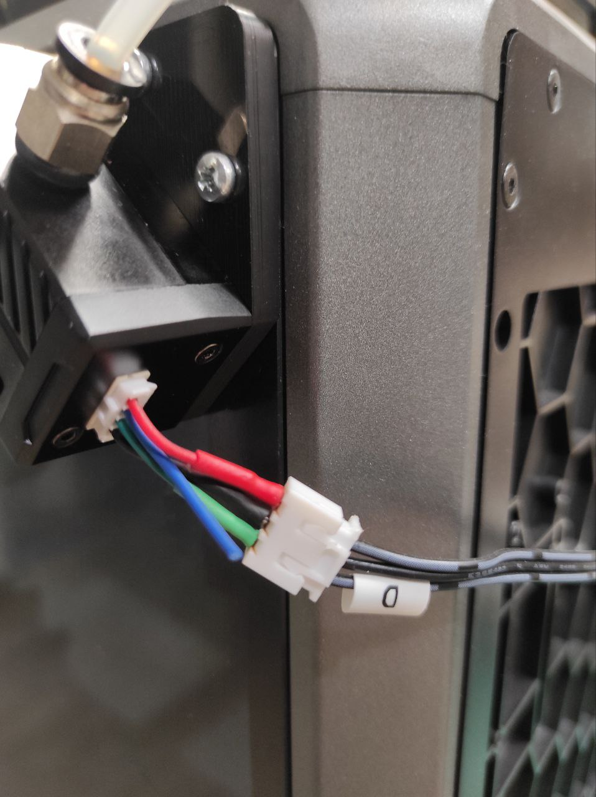

---

<div align="center">

**[↩️ Вернуться в главное меню](../readme.md)**

</div>
