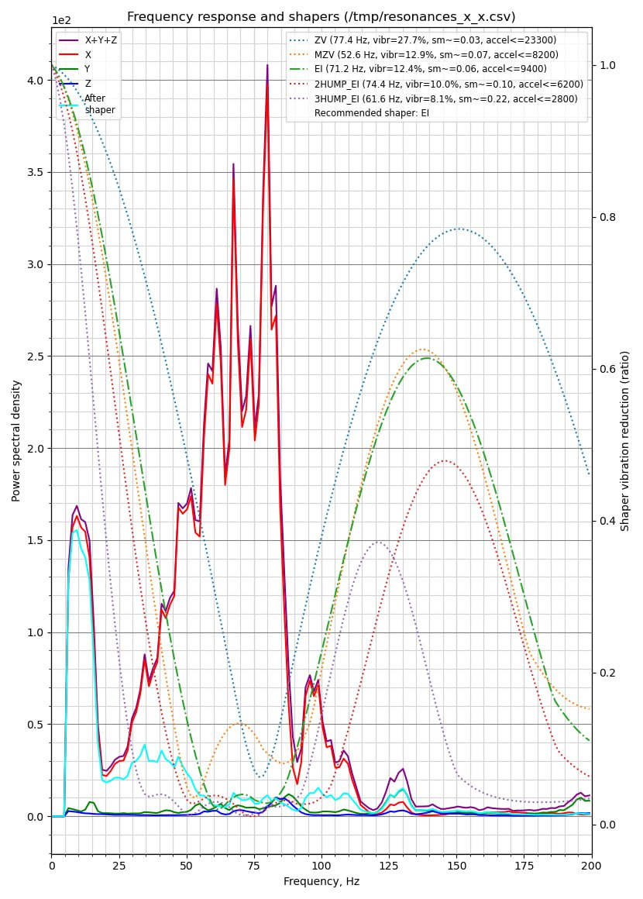
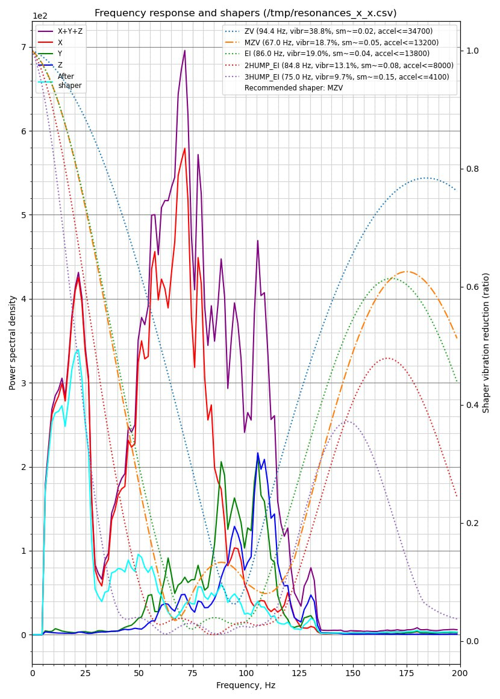
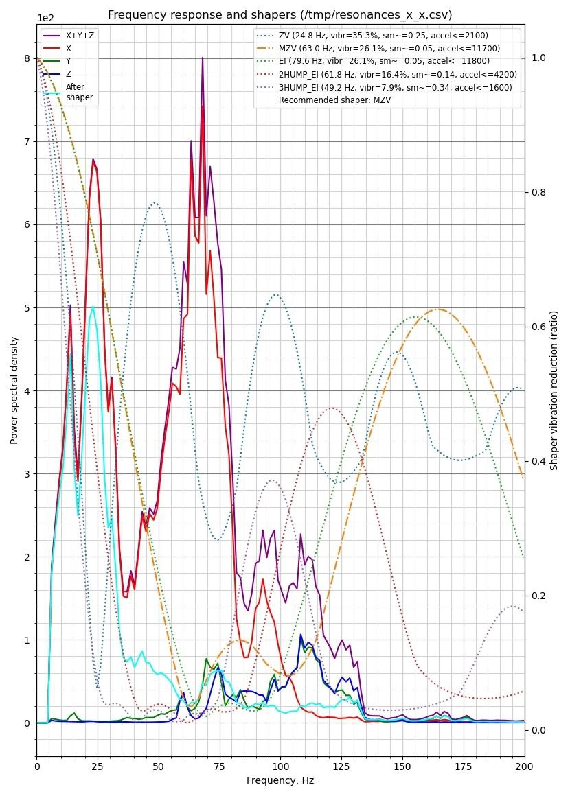
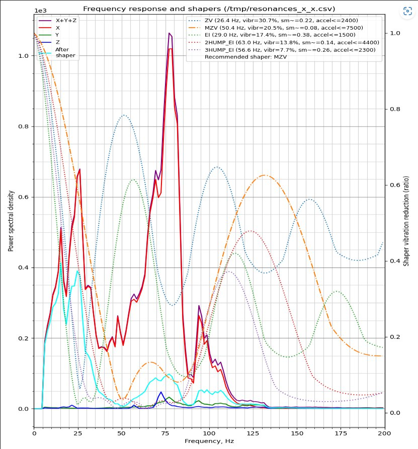
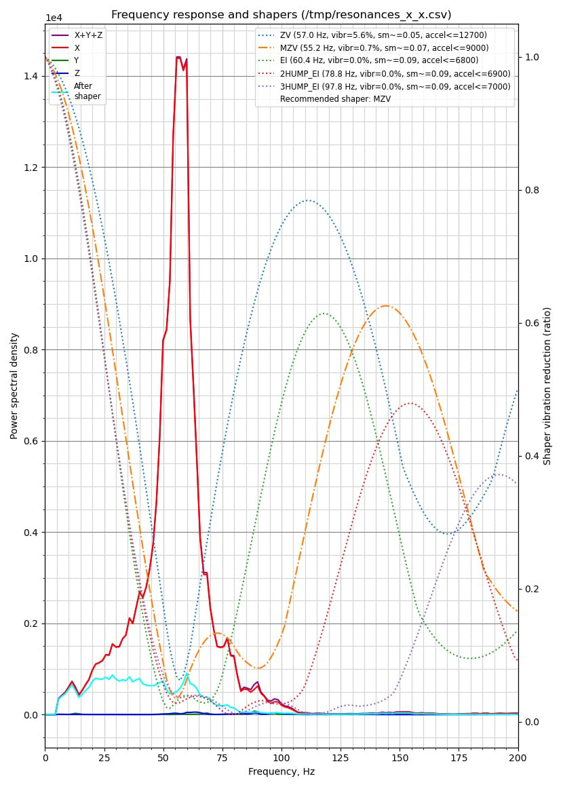
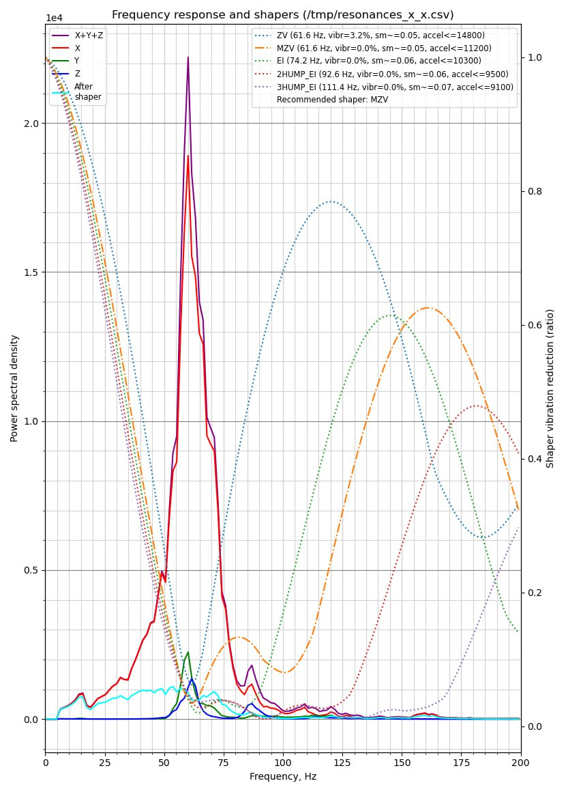
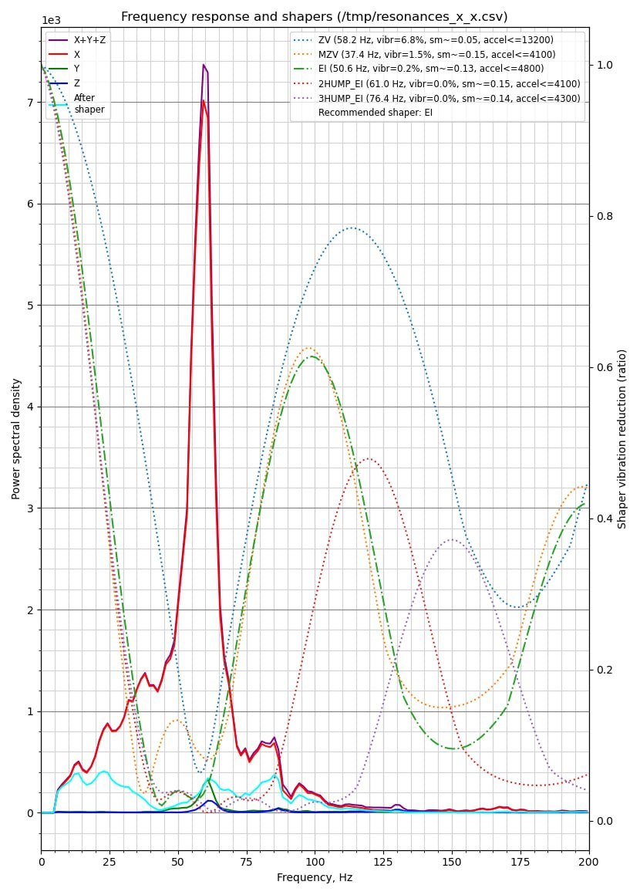

[↩️ Назад в главное меню](../readme.md)

---

# 📊 Читаем графики шейперов

> Быстро разбираемся с графиками шейперов для Creality K1 серии

<h3 align="right"><a href="https://www.tinkoff.ru/rm/yakovleva.irina203/51ZSr71845" target="_blank">💝 Поддержать автора</a></h3>

---

## 📚 Оглавление

- [🎯 Для чего это руководство](#-для-чего-это-руководство)
- [🧪 Как провести тест](#-как-провести-тест)
- [📈 Плохие графики](#-плохие-графики)
- [🔧 Как вылечить клин X](#-как-вылечить-клин-x)
- [✅ Хорошие графики](#-хорошие-графики)

---

## 🎯 Для чего это руководство

Основная статья по шейперам у меня как и раньше [расположена тут](https://github.com/Tombraider2006/klipperFB6/tree/main/accel_graph).

Данный материал предназначен для тех, кто решает **надо ли производить расточку посадочных мест под втулки печатной головы или ему повезло**. Максимально упрощенно и максимально наглядно покажу что и как делать.

---

## 🧪 Как провести тест

Для того чтобы произвести тест необходимо поставить [**Helper Script**](https://guilouz.github.io/Creality-Helper-Script-Wiki/helper-script/helper-script-installation/)

Если он уже у вас установлен находим макрос `TEST_RESONANCES_GRAPHS`, запускаем и дожидаемся выполнения.

После окончания теста в папке `/Helper-Script/improved-shapers` будут находится наши графики.

**Нас интересует тот, что отображает данные по оси X.**

---

## 📈 Плохие графики

Как могут выглядеть плохие графики:

### ⚠️ На что смотреть:

Обратите внимание на **голубую линию** которая обозначает кривую резонансов *после* применения шейперов. 

На всех вышеперечисленных графиках мы видим **ярко выраженный пик в районе 12-17 герц**. 

Это означает что вам необходимо провести работы со втулками оси X 🔧

---

## 🔧 Как вылечить клин X

<b>Основная проблема принтеров Creality серии K1 и её устранение</b>

### 🎓 Немного теории:

"Голова" принтера перемещается по оси X на двух круглых полых валах. Для плавного и тихого скольжения используются две бронзово-графитные втулки.

- **Нижняя втулка** установлена в голове неподвижно
- **Верхняя втулка** с "плавающей" посадкой для компенсации небольшой несоосности валов (при ограниченных бюджете и массе прецизионная конструкция невозможна)

Канал под втулку имеет слегка овальное сечение, поэтому она имеет возможность немного изменять положение своей оси.

Чтобы втулка не вылетела из головы, она ограничена по бокам (но не зажата намертво!) двумя шурупами. Чтобы голова не болталась на плавающей втулке - та поджата спереди двумя пружинами.

### 😱 Суть проблемы:

Внутри канала верхней втулки есть **литьевой дефект**: внутрь торчит горбик (примерно посередине канала) и заклинивает втулку. Вдобавок к этому два торцевых шурупа при закручивании также выдавливают пластик внутрь канала, и он поджимает втулку.

### 🛠️ Что делать:

⚠️ **Важно:** Работаем только с верхней втулкой, нижнюю не трогаем! Её канал строго круглого сечения и она в нём плотно запрессована, двигаться не должна.

**Порядок действий:**

1. Снять кожух обдува с головы
2. Отсоединить прижимной кронштейн с кабелем (под ним 2 пружины - **не потеряйте!**)
3. Выкрутить два шурупа, ограничивающие втулку по бокам
4. Выдавить втулку в сторону (иногда это совсем непросто - сразу мешает дефект)

**Инструмент:**  
Оправка, пригодная как для выталкивания втулки, так и для расточки головы:  
https://www.printables.com/model/1022787-tool-for-modifying-the-x-axis-carriage-for-k1-k1c

**Расточка:**  
1. Наклеить на оправку полоску шкурки 500 гридности  
   (https://www.ozon.ru/product/nazhdachnaya-bumaga-vodostoykaya-sia-shkurka-shlifovalnaya-p500-nazhdachka-280x230-mm-628624774/)
2. Вращательно-поступательными движениями аккуратно сточить 3 проблемных точки
3. Втулка в итоге должна **свободно заходить в канал, пальцем навылет**

⚠️ **Главное не переусердствовать!** Пара человек уже так расточила, что всё болтаться начало.

### 🧼 Чистка и смазка:

Внутренности втулок промываем от остатков старой смазки и загрязнений:
1. Вытираем валы насухо (бумажными салфетками)
2. Капаем по одной капле жидкого машинного масла на вал
3. Раскатываем, двигая голову вправо-влево
4. Снова вытираем и повторяем

**Рекомендуемое масло:**  
Для валов оси X с медно-графитовыми втулками - жидкое машинное масло (И-20А или для швейных машинок). Достаточно **1 капли на каждый вал**. 

⚠️ Из-за малого зазора между втулками и валами **густая смазка будет тормозить движение** и портить шейперы.

### 🔩 Опционально - замена пружин:

Можно (но не обязательно) заменить 2 штатные прижимные пружины на более мягкие:
- Длина: 10 мм
- Диаметр: 4,7 мм  
- Проволока: 0,5 мм
- https://www.ozon.ru/product/pruzhina-szhatiya-dlina-l-10-mm-shirina-d-4-7-mm-diametr-provoloki-d-0-5-mm-10-sht-v-upakovke-1009309923/

---

## ✅ Хорошие графики

Как выглядит график у тех кто провел операцию по устранению и у тех, **кому повезло купить принтер без косяков** и не игнорировать смазку осей:

---

## 📝 P.S.

В данном руководстве **не рассматриваются конкретные значения ускорений**. Графики рассматриваются исключительно по кривым резонансов и служат для демонстрации возможных проблем и их решений.

---

**[↩️ Вернуться в главное меню](../readme.md)**

