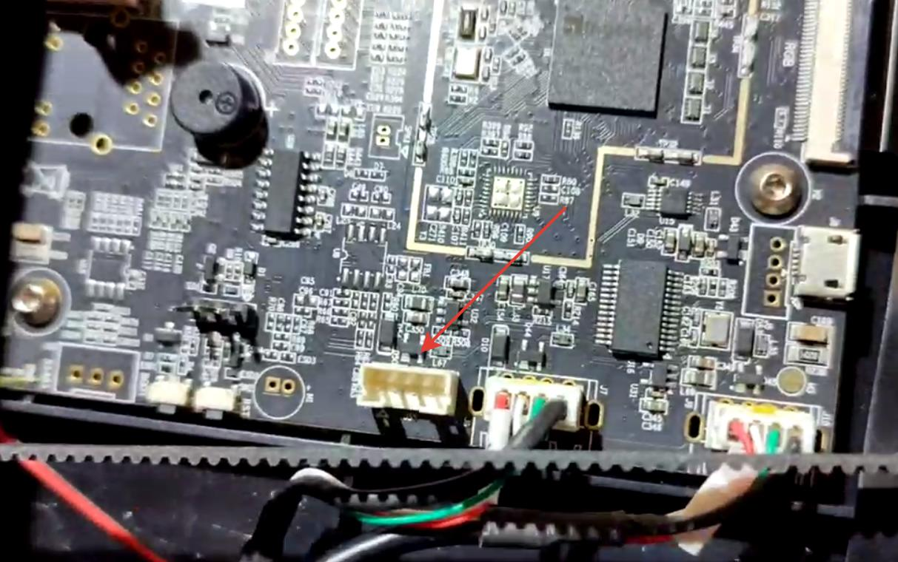
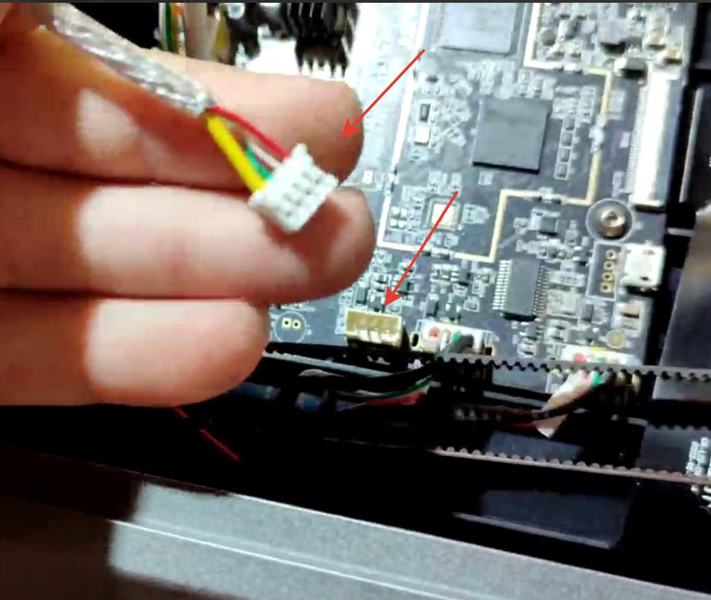
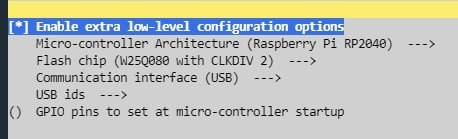
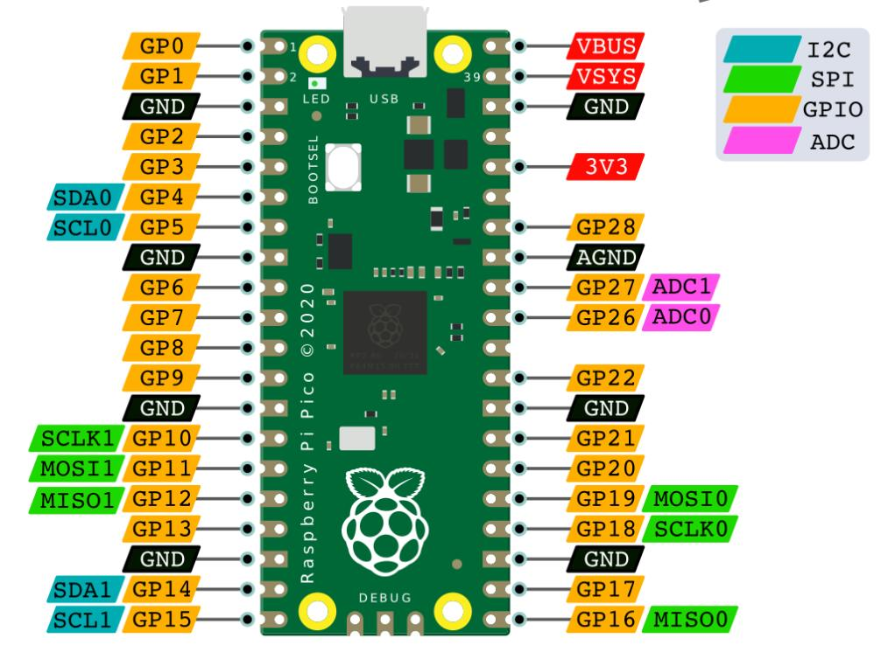
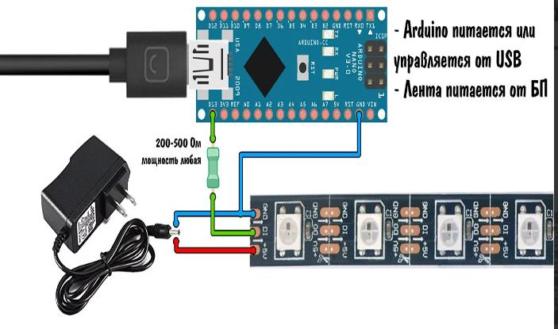
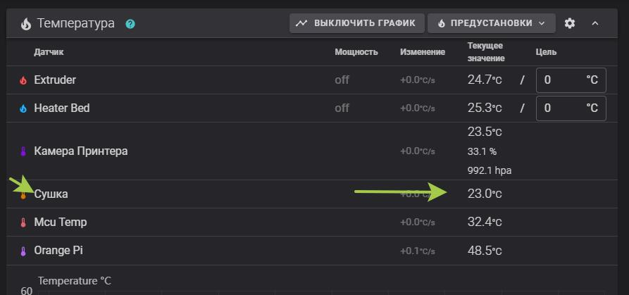

[↩️ Назад в главное меню](../readme.md)

---

# 🔌 Подключение Raspberry Pico к принтеру

> Расширение количества пинов для ваших самоделок и дополнений

<h3 align="right"><a href="https://www.tinkoff.ru/rm/yakovleva.irina203/51ZSr71845" target="_blank">💝 Поддержать автора</a></h3>

---

## 📑 Оглавление

- [📖 Зачем это нужно](#-зачем-это-нужно)
- [🔧 Подготовка и прошивка](#-подготовка-и-прошивка)
- [⚙️ Конфигурация](#️-конфигурация)
- [💡 Примеры использования](#-примеры-использования)

---

## 📖 Зачем это нужно

Основным препятствием в ваших самоделках может быть отсутствие свободных пинов на материнской плате принтера. Данный мануал даст вам возможность добавить их некоторое количество с помощью подключения дополнительного MCU основанного на Raspberry Pico.

### 🎯 Преимущества:

**Дополнительным плюсом** данного решения является то что в случае форс-мажора, в 90% случаев, сгорит плата за 500р которая не влияет на процесс печати. Если искать пин на плате принтера - в случае форс-мажора и неисправности материнской платы траты в виде 5000р и простой принтера на время доставки платы.

---

## 🔧 Подготовка и прошивка

### Шаг 1: Вскрываем днище


### Шаг 2: Находим свободный USB разъем



*Свободный он у пользователей К1 / К1С, но и пользователям К1 Макс обычно он не нужен так как задействован под лидар который все снимают*

### Шаг 3: Обжимаем разъем

Обжимаем разьем из любого подходящего micro USB кабеля. Разъёмы на плате принтера для всех USB подключений - **JST PH 2.0 mm 4pin (PH2.0 4P)**

**Ремарка:** Тут сделаю небольшую ремарку, вывести кабель я предлагаю на заднюю стенку принтера, благо там есть и кабель каналы и отверстия подходящие. Можно вывести не просто разьем microUSB а полноценный хаб на 2-4 разьема, **его и проверить легче - определилась вставленная флешка - значит все соединено правильно.**



### Шаг 4: Прошиваем Pico

Теперь нам нужно прошить нашу Pico. На самом принтере "К1" серии это сделать проблематично, поэтому есть несколько вариантов поставить Klipper на другую подходящую железку:

```bash
cd ~/klipper
make clean
make menuconfig
```

В меню выбрать:



Потом:

```bash
make
```

Переходим в каталог, в который скомпилировалась прошивка `cd ~/klipper/out` и смотрим там листинг файлов `ls -la`. Там должен быть файл с именем `klipper.uf2`

**Или не мучаться** и скачать готовую прошивку [**тут**](klipper.zip) - не забудьте распаковать файл.

> *Чужой конфиг / прошивка - как чужие трусы. Подойти может но послевкусие неприятное* 😄

### Шаг 5: Прошиваем

UF2 режим можно активировать удерживанием кнопки BOOTSEL при подачи питания по USB. Появится накопитель «RPI-RP2», который можно использовать для копирования бинарных файлов uf2.

### Шаг 6: Подключаем к разъему

Зайдя на наш принтер по SSH выполняем:

```bash
ls /dev/serial/by-path/*
```
(также можно использовать `/dev/serial/by-id/`)

```bash
ls /dev/serial/by-id/*
```

Должны увидеть что-то типа такого *(цифры буквы могут быть другими, важно что такое устройство определяется)*:

```
/dev/serial/by-id/usb-Klipper_rp2040_E660B4404B3EAB35-if00
```

**Если не увидели**, возможные варианты:
- Плохой кабель
- Неправильно сделан разъем

### Шаг 6.1: Корпус для MCU

Предлагаю сразу распечатать корпус для нашей MCU чтобы не выглядело лютым колхозом. [**Модель тут**](https://www.printables.com/model/226610-raspberry-pi-pico-case/files)

---

## ⚙️ Конфигурация

### В `printer.cfg` добавляем:

```ini
[mcu pico]
serial: /dev/serial/by-id/usb-Klipper_rp2040_E660B4404B3EAB35-if00 # строку берем из пункта 6
```

Где после `serial:` идет та строка что мы получили в предыдущем пункте.

Теперь у нас все готово для добавления наших пинов в наши проекты!



### Обращение к Pin

После прошивки и конфигруации MCU Raspberry Pico сразу предоставляют доступ к своим pin. **Единственным условим** их корректного использования будет четкое указание к какому Pin идет обращение.

Например, у нас есть MCU Pico:
```ini
[mcu pico]
serial: /dev/serial/by-id/usb-Klipper_rp2040_E660B4404B3EAB35-if00
```

Обращение к его Pin внутри конфигурационного файла будет выглядеть следующим образом:

```
pico:gpio1
```

---

## 💡 Примеры использования

### 📏 FWS (Датчик толщины филамента)

Например - конфиг для датчика толщины филамента будет выглядеть так:

```ini
[hall_filament_width_sensor]
adc1: pico:gpio26
adc2: pico:gpio27
cal_dia1: 1.48
cal_dia2: 1.99
raw_dia1: 8750
raw_dia2: 9175
default_nominal_filament_diameter: 1.75
max_difference: 0.150
measurement_delay: 665
enable: True
logging: True
measurement_interval: 5
```

### 💡 NEOPIXEL (Адресная лента)

Подключить светодиодную ленту можно например так:

```ini
[neopixel pico]
pin: pico:gpio16
#color_order: GRB
initial_GREEN: 0.5
```

**Важно:** На управляющий провод в цепь вставить резистор 200-500Ом, объединить GND питания ленты и платы. Запитывать адресную ленту из расчета **0.2 ватта на 1 светодиод**.

#### Пример расчета:

1. Если у нас 100 светодиодов на 5 вольт: `100*0.2/5=4А`  
   → Нужна плата понижения напряжения с 24 до 5 вольт на 4 ампера

2. Если у нас 100 светодиодов на 12 вольт: `100*0.2/12=1.67А`  
   → Нужна плата понижения напряжения с 24 до 12 вольт на 2 ампера

В обоих вариантах предполагается что источником питания ленты будет БП принтера через понижающее реле.



*Картинка про Arduino но суть та же.*

**Разница:** Неопиксель через RPi дает возможность управлять лентой из клиппера, но там же придется и писать все эффекты. Вариант с прошивкой WLED ESP32 дает возможность делать ссылки на сохраненные в прошивке ESP эффекты. **Если смотреть на адресную ленту как на гирлянду**, то предпочтительнее выглядит вариант ESP32. Если есть задумки использовать в конфиге ленту (например счетчик процентов печати в количестве светодиодов включенных) то RPi2040 выглядит интереснее.

### 🔊 BEEPER (Бипер)

```ini
[gcode_macro M300]
gcode:
    # Use a default 1kHz tone if S is omitted.
    
    # Use a 10ms duration is P is omitted.
    
    
      SET_PIN PIN=BEEPER VALUE=0.5 CYCLE_TIME={ 1.0/S }
      G4 P{P}
    
      G4 P{P}
    
      SET_PIN PIN=BEEPER VALUE=0
```

Макрос для реакций на команду М300. Конвертнуть MIDI файлы в G-code можно [**тут**](https://www.layerfused.com/MIDI-M300)

**Не забываем** поставить правильный пин куда воткнули наш **ПАССИВНЫЙ** бипер, иначе разницы в тонах не получим.

```ini
[output_pin BEEPER]
pin: pico:gpio8
pwm: True
value: 0
shutdown_value: 0
cycle_time: 0.001
```

Вообще с пинами можно делать много чего например включать и выключать (подробно можно почитать в [Klipper Reference](https://github.com/Klipper3d/klipper/blob/master/docs/Config_Reference.md#output_pin)), снимать с них данные, даже управлять сервоприводом.

### 🔩 SERVO (Сервопривод)

```ini
[servo matrix]
pin: pico:gpio16 #  пин на плате
maximum_servo_angle: 180 # градус сервы
minimum_pulse_width: 0.0008 # по умолчанию 0.001, тут можно поиграться когда серва не поворачивается на полную
maximum_pulse_width: 0.0025 # по умолчанию 0.002, важно не только уменьшать но и увеличивать
initial_angle: 0 # не меняем - это стартовый угол при загрузке принтера
```

### 🌡️ I2C датчики температуры

В следующих примерах придется поискать правильный адресс `i2c_bus: i2c2` может принимать вид от i2c0 до i2c4, но зато потом можно наслаждаться видом датчиков в вашей конфигурации.

Конфиги для датчиков (в любом месте вашего `printer.cfg`):

#### BME280 
[Купить тут](https://alii.pub/6mct88)
```ini
[temperature_sensor Камера_принтера]
sensor_type: BME280
i2c_address: 118
i2c_bus: i2c2
```

#### LM75A
[Купить тут](https://alii.pub/6mct90)
```ini
[temperature_sensor LM75A]
sensor_type: LM75
i2c_address: 72
i2c_bus: i2c2
```

#### HTU21D
[Купить тут](https://alii.pub/6mctad)
```ini
[temperature_sensor HTU21D]
sensor_type: HTU21D
i2c_address: 64
i2c_bus: i2c2
```

После `temperature_sensor` можно вписать произвольное имя, как в первых примерах.

**Важно:** К одной шине SCL\SDA можно подключать несколько датчиков. На данный момент нет возможности проверить, согласно мануалу подключаются они параллельно, но **на всех датчиках кроме первого необходимо выпаять подтягивающие резисторы**.

**P.S.** Адреса i2c устройств прописываются жестко `i2c_address:` - вставить десятичный адресс, не HEX!



---

<div align="center">

**[↩️ Вернуться в главное меню](../readme.md)**

</div>
