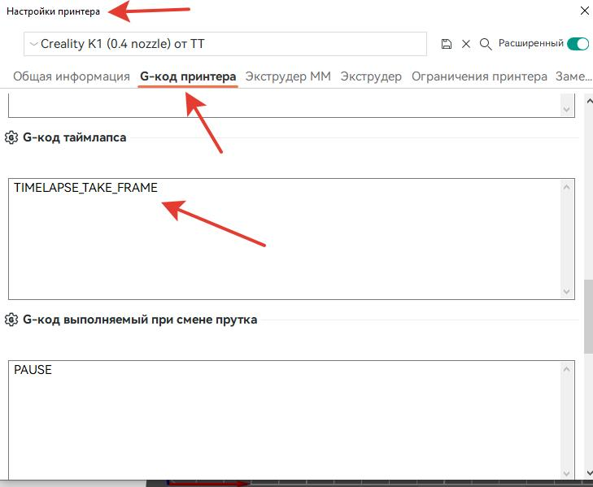
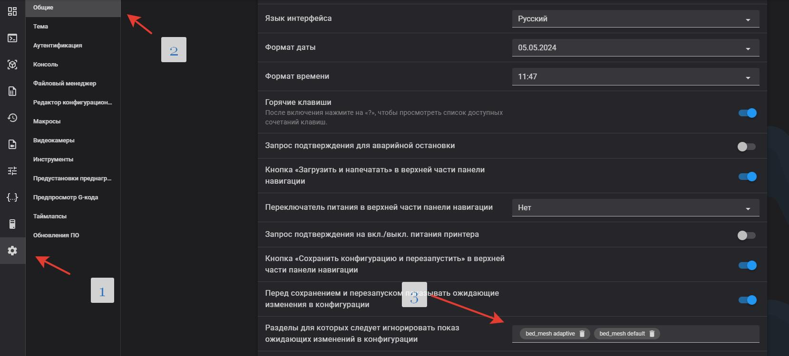

[↩️ Назад в главное меню](../readme.md)

---

# 📥 Инструкция к прошивке 1.3.3.46

> Актуальная версия прошивки с инструкциями по установке - **начинайте читать отсюда!**

<h3 align="right"><a href="https://www.tinkoff.ru/rm/yakovleva.irina203/51ZSr71845" target="_blank">💝 Поддержать автора</a></h3>

---

## 📑 Оглавление

- [🚀 Быстрый старт](#-быстрый-старт)
- [📥 Установка Helper Script](#-установка-helper-script)
- [⚠️ Баги установки](#️-баги-установки)
- [🔧 Установка для CFS (прошивка 2.3.5.33)](#-установка-для-cfs-прошивка-23533)
- [🎯 Калибровки после установки](#-калибровки-после-установки)
- [✨ Что вы получите](#-что-вы-получите)
- [📊 Новый алгоритм Input Shaping](#-новый-алгоритм-input-shaping)
- [🖥️ Guppy Screen update](#️-guppy-screen-update)
- [📂 Конфигурационные файлы](#-конфигурационные-файлы)
- [🆘 Ошибка 3002](#-ошибка-3002)
- [⏳ Обновление Klipper (устарело)](#-обновление-klipper-устарело)

---

## 🚀 Быстрый старт

💡 **Ремарка:** Наибольшая функциональность на данный момент реализована на прошивке [**SimpleAF**](/version_config/SimpleAF.md) - не подходит для Sfc kit

### ⚠️ Перед установкой:

**Рекомендую:** Если у вас были ранее установлены скрипты - перед установкой сбросить прошивку до заводских настроек для исключения накладок.

---

## 📥 Установка Helper Script

Сначала ставим [**HELPER SCRIPT**](https://guilouz.github.io/Creality-Helper-Script-Wiki/helper-script/helper-script-installation/)

### Рекомендованные пункты:

**Для K1 / K1 Max / K1C:**
```
1, 2, 4, 5, 6, 7, 8, 9, 10, 11, 12, 16
```

**Для K1 SE:**
```
1, 2, 4, 5, 6, 10, 11, 12
```
*(нет бокового и заднего вентилятора, нет видеокамеры, нет бипера)*

**Для Sfc kit:**
```
1, 2, 4, 5, 7, 8, 9, 10, 11, 12, 16
```
*(конфликт в макросах старта печати с модулем KAMP)*

📖 Прочитать про каждый из пунктов можно [**тут**](/random/menu.md)

### Шаг 3: Перезагрузка

Перезагружаем принтер по питанию. **Всё работает!** ✅

### Шаг 4: Настройка камеры (если есть)

Если у вас установлена камера:
1. В настройках Fluidd → Камеры → Добавить
2. Пишем любое имя → жмем OK
3. Переходим в настройки интервальной съемки
4. Выбираем нашу камеру

---

## ⚠️ Баги установки
   
### Баг №1: Ошибка сертификата Moonraker

Если во время установки Moonraker начинает ругаться на сертификат - перед установкой скрипта поставьте свой часовой пояс, а потом обновите время:

```bash
hwclock -w
```

Проверить правильность даты и времени можно командой:
```bash
date
```

### Баг №2: Couldn't resolve proxy

Недавно выявлен еще один баг. На команду клонирования с Git появляется ответ `error: Couldn't resolve proxy`

**Лечится командой:**
```bash
git config --global --unset http.proxy
```

---

## 🔧 Установка для CFS (прошивка 2.3.5.33)

### Для K1 с обновлением CFS на прошивке 2.3.5.33

По SSH вставляем следующие команды:

```bash
wget http://bin.entware.net/mipselsf-k3.4/installer/generic.sh -O - | sh
export PATH=/opt/bin:/opt/sbin:$PATH
echo '/opt/etc/init.d/rc.unslung start' >> /etc/rc.local; echo 'exit 0' >> /etc/rc.local
opkg update
opkg install git-http
# opkg install git  # (если предыдущая команда выдала ошибку)
git clone --depth 1 https://github.com/Guilouz/Creality-Helper-Script.git /usr/data/helper-script
mv /usr/bin/git /usr/bin/git.bak
ln -s /opt/bin/git /usr/bin/git
git config --global --add safe.directory /usr/data/moonraker/moonraker
```

После запускаем Helper Script:

```bash
sh /usr/data/helper-script/helper.sh
```

---

## 🎯 Калибровки после установки
 
📚 **Полезные ссылки:**
- [Полезные макросы](/macros_helpfull/readme.md)
- [Калибровки шейперов](/shaper/readme.md)
- [Калибровки ремней](/random/belts/readme.md)

### G-коды для тестов Соркина

**Для калибровок откатов и LA/PA** нужны такие стартовые и конечные коды:

**Стартовый код:**
```gcode
_FULL_BED_MESH_ON
_ADAPTIVE_PURGE_LINE_OFF
START_PRINT EXTRUDER_TEMP=$HOTTEMP BED_TEMP=$BEDTEMP
```

**Конечный код:**
```gcode
SET_PIN PIN=FULL_BED_MESH VALUE=0
_ADAPTIVE_PURGE_LINE_ON
END_PRINT
```

🧪 **Пройти тесты можно [ТУТ](https://k3d.tech/calibrations/)**

---

## ✨ Что вы получите?

После установки у вас будет:

- ✅ **Fluidd и Moonraker** - отправка на печать из любого слайсера по WiFi
- ✅ **Таймлапсы** - интервальная съемка
- ✅ **Бипер** - в конце печати, при паузе и при сработке датчика обрыва филамента
- ✅ **Графики** - шейперов и натяжки ремней
- ✅ **Сохранение Z-offset** - при перезагрузке
- ✅ **Тест на частоте** - для определения резонирующих частей принтера
- ✅ **Улучшенная логика кулеров** - температурный контроль
- ✅ **Адаптивная сетка стола** - с правильным макросом старта печати
- ✅ **Макрос Screws Calibration** - для модификации с барашками стола

⚠️ **ОБЯЗАТЕЛЬНО!!!** Провести тесты шейперов и PID экструдера!!!

### 📷 Настройка таймлапса в OrcaSlicer

Если установили таймлапс, не забудьте прописать его в настройках Orca:



```gcode
TIMELAPSE_TAKE_FRAME
```

### 🔧 Решение проблем

**Проблема с загрузкой Fluidd или Mainsail:**

Необходимо доустановить еще компонент:
```bash
opkg install wget-ssl
```

**Программа доступа по SSH из Windows:**

Мой выбор: [**Bitvise SSH Client**](https://www.bitvise.com/ssh-client-download)

### 💡 Убираем раздражающие напоминания

**Чтобы после каждой печати вас не раздражала надпись "сохранить настройки и перегрузить":**

1. Зайти в **Настройки**
2. Перейти в **Общие**
3. Добавить исключения: `bed_mesh adaptive` и `bed_mesh default`




### ⚠️ Небольшое замечание касательно KAMP

Он включает в себя две функции - адаптивную карту стола и макрос линии прочистки сопла.
Адаптивная карта стола не совместима с несколькими функциями, требующим построения полной карты стола.
В их число входит калибровка PA при помощи лидара и штатная линия прочистки сопла на левом краю стола, которая включается если отключена адаптивная линия прочистки из KAMP. Ни в коем случае не отключайте линию прочистки, если у вас включена адаптивная карта стола - это может привести к повреждению покрытия стола (хотя куда более вероятно простое налипание пластика на сопло из-за того, что оно слишком далеко от стола).

Точность калибровки лидаром также подвергается сомнению, вследствие чего чаще всего его рекомендуется просто отключить (вплоть до физического удаления с печатной головки принтера).

**Для мультиматериальных систем:**

Также, если у вас используется мультиматериальная система (ERCF, TradRack, MMU, CFS и им подобные) - обратите внимание, что **башня очистки не получает своего названия объекта** и из-за этого на неё не распространяется область построения карты стола. Пожалуйста, планируйте её размещение так, чтобы она попадала между другими объектами.

---

## 📊 Новый алгоритм Input Shaping

Прочитать про отличия нового от старого алгоритма можно [**тут**](https://klipper.discourse.group/t/a-bit-different-resonance-test/17227)


### Автоматический скрипт установки


Запускаем строчку в консоли SSH, выбираем пункт. После установки произойдет перезагрузка принтера для применения настроек. **Всё!**

```bash
wget --no-check-certificate -O /tmp/shaper.sh https://raw.githubusercontent.com/Tombraider2006/K1/refs/heads/main/random/shaper.sh && chmod +x /tmp/shaper.sh && sh /tmp/shaper.sh
```

<details><summary><b>Ручной способ установки</b></summary>
Чтобы его применить заходим по SSH и копируем следующий блок:

```bash
cd /usr/share/klipper/klippy/
mv toolhead.py toolhead.py.bak
rm toolhead.pyc
wget -P /usr/share/klipper/klippy/ https://raw.githubusercontent.com/Konstant-3d/K1C-mods/refs/heads/main/usr/share/klipper/klippy/toolhead.py
chmod 644 toolhead.py
cd /usr/share/klipper/klippy/extras/
mv resonance_tester.py resonance_tester.py.bak
mv shaper_calibrate.py shaper_calibrate.py.bak
rm resonance_tester.pyc
rm shaper_calibrate.pyc
wget -P /usr/share/klipper/klippy/extras/ https://raw.githubusercontent.com/Konstant-3d/K1C-mods/refs/heads/main/usr/share/klipper/klippy/extras/resonance_tester.py
wget -P /usr/share/klipper/klippy/extras/ https://raw.githubusercontent.com/Konstant-3d/K1C-mods/refs/heads/main/usr/share/klipper/klippy/extras/shaper_calibrate.py
chmod 644 resonance_tester.py
chmod 644 shaper_calibrate.py
sed -i 's/accel_per_hz: 75/accel_per_hz: 60/' /usr/data/printer_data/config/printer.cfg
reboot
```

После введения данных команд принтер перезагрузится и у вас будет новый алгоритм.

### Возврат к старому алгоритму

Если захотите вернуться к старому алгоритму:

**Вариант 1:** В `printer.cfg` находим раздел `[resonance_tester]` и вписываем параметр:
```ini
sweeping_period: 0
```

**Вариант 2:** В панели SSH вписываем следующий код:

```
cp /usr/data/printer_data/config/printer.cfg /usr/data/printer_data/config/printer.cfg.bak

sed -i '/resonance_tester/{
n
n
n
n
n
n
a\
sweeping_period: 0
}' /usr/data/printer_data/config/printer.cfg


```

### Возврат к новому алгоритму

Если захотим вернуть к новому алгоритму:

```bash
cp /usr/data/printer_data/config/printer.cfg /usr/data/printer_data/config/printer.cfg.bak

sed -i '/resonance_tester/{
n
n
n
n
n
n
a\
sweeping_period: 1.2
}' /usr/data/printer_data/config/printer.cfg
```

Или в файле `printer.cfg` находим значение параметра `sweeping_period: 0` меняем на `sweeping_period: 1.2`

### ⚠️ Для K1SE с прошивкой 1.3.5.11
По неведомой причине для данной прошивки необходим немного другой файл. Решение уже найдено. Чтобы его применить **вам, и только вам!**, на других прошивках и принтерах работать не будет.

Необходимо в консоль SSH дополнительно к основному скрипту скопировать следующие команды:

```bash
cd /usr/share/klipper/klippy/
mv toolhead.py toolhead.py.bak1
wget -P /usr/share/klipper/klippy/ https://raw.githubusercontent.com/Konstant-3d/K1C-mods/refs/heads/main/usr/share/klipper/klippy/toolhead_1_3_5_11.py
mv toolhead_1_3_5_11.py toolhead.py
chmod 644 toolhead.py
reboot
```

После введения данных команд принтер перезагрузится и у вас будет новый алгоритм.

</details>

### 💡 Продолжая тему нового алгоритма

С одной стороны он несомненно показывает более точные результаты по компенсации резонанса, но **сильно смазывает картину при диагностике** по моему мануалу определения "нужно ли лечить ось икс".

**Поэтому моя рекомендация:**
1. Сначала смотрим график по старому алгоритму
2. Лечим по необходимости
3. Потом устанавливаем новый алгоритм
4. На его основе устанавливаем шейперы

---

## 🖥️ Guppy Screen update

### Что нового в исправленной версии:

1. ✅ Пересобраны шрифты - используется NotoSans-Medium, включено subpx-сглаживание, **поддерживается кириллица**
2. ✅ Изменены значения экструда на экране Extrude - более удобные в реальной жизни
3. ✅ Поправлено обрезание статуса файла нижними кнопками на панели Print
4. ✅ Поправлен выпадающий список Display sleep в настройках Guppy
5. ✅ Исправление остатка прутка в Spoolman + работают USB-флешки

### Установка скриптом из Helper Script:

1. Открыть скрипт на редактирование:  
   `/usr/data/helper-script/files/guppy-screen/guppy-update.sh`
   
2. Найти строку:  
   `"$CURL" -s https://api.github.com/repos/ballaswag/guppyscreen/releases -o /tmp/guppy-releases.json`
   
3. Исправить слово `ballaswag` на `neonman63`

4. Запустить скрипт:
   ```bash
   sh /usr/data/helper-script/files/guppy-screen/guppy-update.sh
   ```

### Установка обновления вручную:

1. Закинуть архив любым способом в каталог /usr/data, например:
```
wget 'https://github.com/neonman63/guppyscreen/releases/download/nightly/guppyscreen.tar.gz' -O /usr/data/guppyscreen.tar.gz
или
scp guppyscreen.tar.gz root@ip-printer:/usr/data/
tar -xvf /usr/data/guppyscreen.tar.gz -C /usr/data/guppyscreen/..
/etc/init.d/S99guppyscreen stop
killall -q guppyscreen
/etc/init.d/S99guppyscreen restart
rm -f /usr/data/guppyscreen.tar.gz
```

**Enjoy!** 🎉

---

## 📂 Конфигурационные файлы

Вот [**конфиги посмотреть**](/version_config/1_3_3_36/) - в комментариях в файлах `printer.cfg` и `gcode_macro.cfg` можно увидеть какие параметры я менял и прочитать зачем.

*Это конфиг для стокового К1 с заменой шкивов и моторов. (В printer.cfg указаны строки где и что менять в 4 местах при замене на 20-зубые шкивы)*

---

## 🆘 Ошибка 3002

### Для всех кто обновился не удалив Helper Script 

Заходим по SSH и пробуем:

#### Способ 1:
```bash
/etc/init.d/S58factoryreset reset
```

После выполнения ваш принтер запустится со сбросом настроек до значений по умолчанию. Сохранятся только пользовательские настройки и параметры подключения.

#### Способ 2 (если первый не помог):

```bash
echo "all" | nc -U /var/run/wipe.sock
```

После выполнения появится сообщение `ok`, и принтер перезагрузится, а настройки будут сброшены до значений по умолчанию.

⚠️ Необходимо повторно подключить принтер к сети с помощью экранного интерфейса: **Settings → Network tab**.

### Переустановка Helper Script:

После сброса включаем root и заново накатываем Helper Script:

```bash
git clone https://github.com/Guilouz/Creality-Helper-Script.git /usr/data/helper-script
```

И введите эту команду для запуска скрипта:
```bash
sh /usr/data/helper-script/helper.sh
```

---

## ⏳ Обновление Klipper (устарело)

### Порядок установки если вам нужен более новый Klipper:

⚠️ **Внимание:** Эта инструкция устарела!

Действия, которые нужно сделать:

1. Сбросьте настройки до заводских результатов
2. Убедитесь, что у вас установлена последняя версия прошивки
3. Получите права root на компьютере
4. Установите пакет Fluidd, Moonraker и менеджер Entware только с https://guilouz.github.io/Creality-Helper-Script-Wiki/
5. Обновите Klipper до более новой версии, следуя инструкции: https://github.com/K1-Klipper/installer_script_k1_and_max
6. Вернитесь и установите дополнительные вспомогательные скрипты с помощью установщика Guilouz
7. В `printer.cfg` найти раздел `[printer]`, в нём удалить строчку `max_accel_to_decel` и заменить на:
   ```ini
   minimum_cruise_ratio: 0.5
   ```

Это даст вам Klipper от **~8 апреля 2024.**

⚠️ **На данный момент проект приостановлен и вряд ли будет обновляться далее.**

---

<div align="center">

**[↩️ Вернуться в главное меню](../readme.md)**

⭐ **Поставьте звездочку проекту - так другим пользователям легче его найти!** ⭐

</div>
